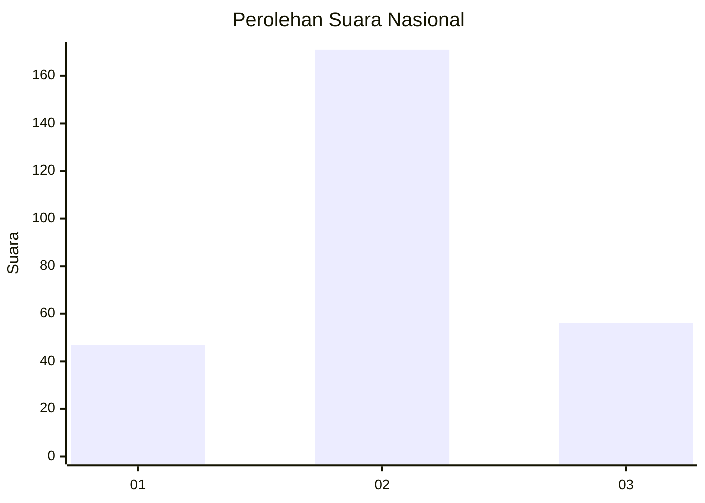
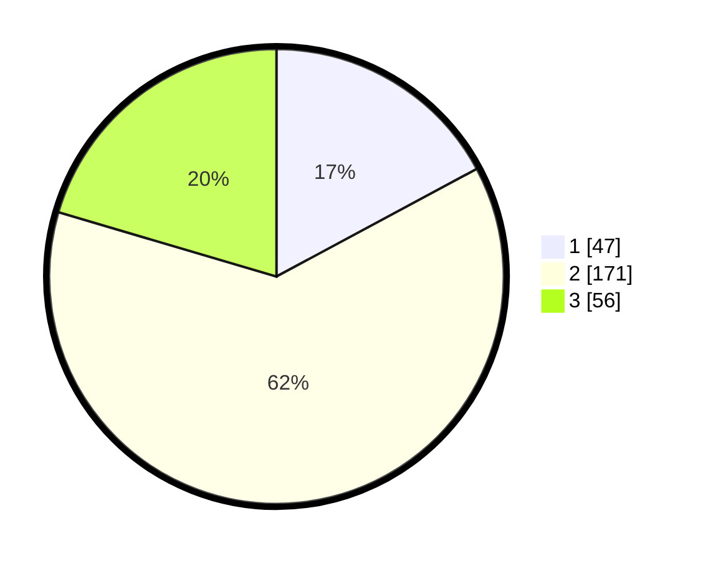

# Hasil

## Grafik

## Tabel

| No. | Nama Paslon    | Suara | Suara (raw) | Persentase |
|:--- |:-------------- | -----:| -----------:| ----------:|
| 1   | ANIES MUHAIMIN | 47    | [47][p-1]   | 17,15      |
| 2   | PRABOWO GIBRAN | 171   | [171][p-2]  | 62,41      |
| 3   | GANJAR MAHFUD  | 56    | [56][p-3]   | 20,44      |

[p-1]: https://github.com/gigit-pemilu/pemilu-2024/blob/main/pilpres/hitung-suara/sub/94-papua-tengah/sub/04-mimika/sub/01-mimika-baru/sub/1007-sempan/sub/022-tps/sub/paslon-1.txt
[p-2]: https://github.com/gigit-pemilu/pemilu-2024/blob/main/pilpres/hitung-suara/sub/94-papua-tengah/sub/04-mimika/sub/01-mimika-baru/sub/1007-sempan/sub/022-tps/sub/paslon-2.txt
[p-3]: https://github.com/gigit-pemilu/pemilu-2024/blob/main/pilpres/hitung-suara/sub/94-papua-tengah/sub/04-mimika/sub/01-mimika-baru/sub/1007-sempan/sub/022-tps/sub/paslon-3.txt

## Foto C Plano

https://sirekap-obj-formc.kpu.go.id/bb9a/pemilu/ppwp/94/04/01/10/07/9404011007022-20240214-131423--5afb799f-6df2-4609-87f2-cdfa2c8962c2.jpg

https://sirekap-obj-formc.kpu.go.id/bb9a/pemilu/ppwp/94/04/01/10/07/9404011007022-20240214-131509--c0083885-aa3b-4356-ac85-b4a6d46b2e3b.jpg

https://sirekap-obj-formc.kpu.go.id/bb9a/pemilu/ppwp/94/04/01/10/07/9404011007022-20240214-131555--3f98ec70-1547-4db2-a184-bb35e66ce8ed.jpg

## Metadata

| Key        | Value               |
| ---------- | ------------------- |
| Time Stamp | 2024-02-15 20:30:46 |

