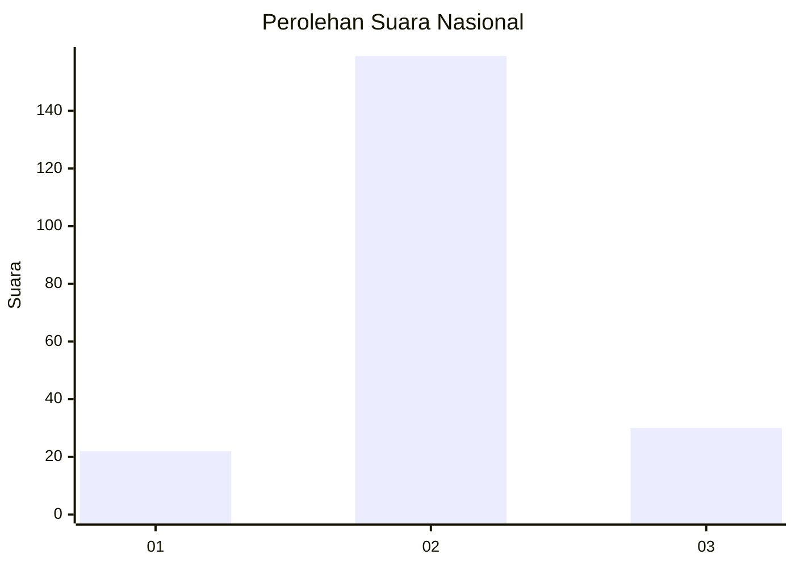
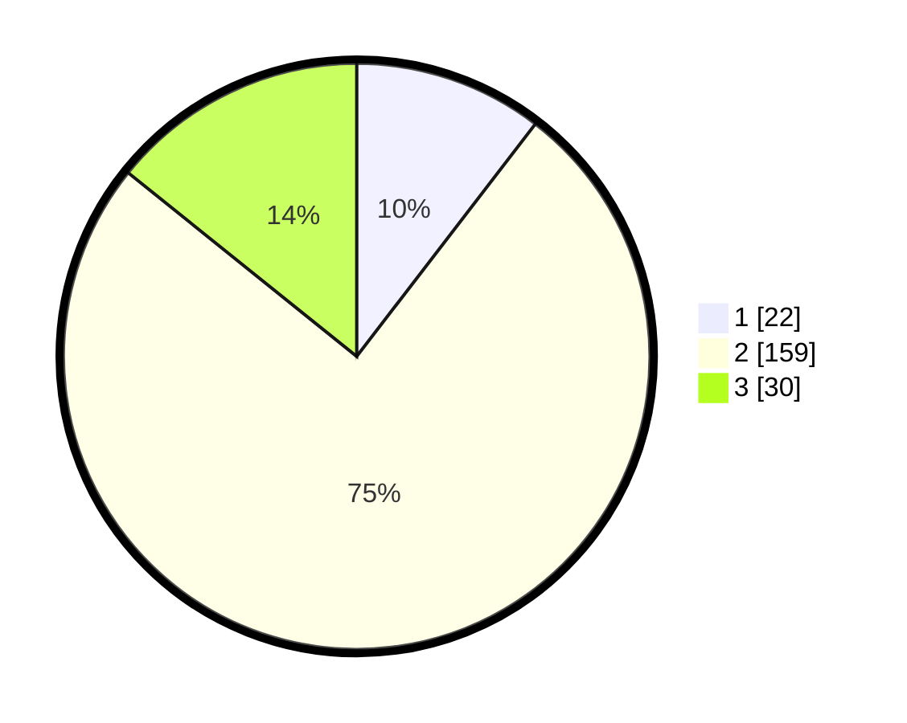

# Hasil

## Grafik

## Tabel

| No. | Nama Paslon    | Suara | Suara (raw) | Persentase |
|:--- |:-------------- | -----:| -----------:| ----------:|
| 1   | ANIES MUHAIMIN | 22    | [22][p-1]   | 10,43      |
| 2   | PRABOWO GIBRAN | 159   | [159][p-2]  | 75,36      |
| 3   | GANJAR MAHFUD  | 30    | [30][p-3]   | 14,22      |

[p-1]: https://github.com/gigit-pemilu/pemilu-2024/blob/main/pilpres/hitung-suara/sub/94-papua-tengah/sub/04-mimika/sub/01-mimika-baru/sub/1007-sempan/sub/029-tps/sub/paslon-1.txt
[p-2]: https://github.com/gigit-pemilu/pemilu-2024/blob/main/pilpres/hitung-suara/sub/94-papua-tengah/sub/04-mimika/sub/01-mimika-baru/sub/1007-sempan/sub/029-tps/sub/paslon-2.txt
[p-3]: https://github.com/gigit-pemilu/pemilu-2024/blob/main/pilpres/hitung-suara/sub/94-papua-tengah/sub/04-mimika/sub/01-mimika-baru/sub/1007-sempan/sub/029-tps/sub/paslon-3.txt

## Foto C Plano

https://sirekap-obj-formc.kpu.go.id/0b35/pemilu/ppwp/94/04/01/10/07/9404011007029-20240215-051226--116eafa8-0e1d-4d87-948f-a0cecff71411.jpg

https://sirekap-obj-formc.kpu.go.id/0b35/pemilu/ppwp/94/04/01/10/07/9404011007029-20240215-051332--595ccf81-1408-40f1-b93b-2b264fbbd84f.jpg

https://sirekap-obj-formc.kpu.go.id/0b35/pemilu/ppwp/94/04/01/10/07/9404011007029-20240215-051424--84bbc380-2168-47cd-b1ed-f8d5e2bcd6a4.jpg

## Metadata

| Key        | Value               |
| ---------- | ------------------- |
| Time Stamp | 2024-02-24 22:31:28 |

