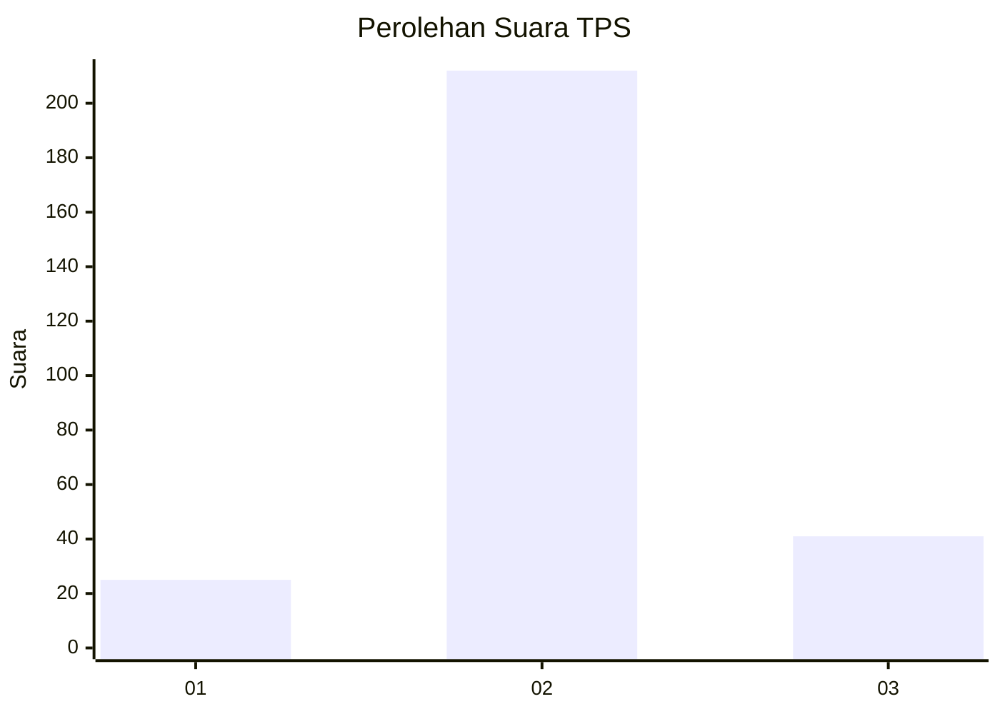

# Hasil

## Grafik

## Tabel

| No. | Nama Paslon    | Suara | Suara (raw) | Persentase |
|:--- |:-------------- | -----:| -----------:| ----------:|
| 1   | ANIES MUHAIMIN | 25    | [25][p-1]   | 8,99       |
| 2   | PRABOWO GIBRAN | 212   | [212][p-2]  | 76,26      |
| 3   | GANJAR MAHFUD  | 41    | [41][p-3]   | 14,75      |

[p-1]: https://github.com/gigit-pemilu/pemilu-2024-94-papua-tengah/blob/main/pilpres/hitung-suara/sub/94-papua-tengah/sub/04-mimika/sub/01-mimika-baru/sub/1007-sempan/sub/030-tps/sub/paslon-1.txt
[p-2]: https://github.com/gigit-pemilu/pemilu-2024-94-papua-tengah/blob/main/pilpres/hitung-suara/sub/94-papua-tengah/sub/04-mimika/sub/01-mimika-baru/sub/1007-sempan/sub/030-tps/sub/paslon-2.txt
[p-3]: https://github.com/gigit-pemilu/pemilu-2024-94-papua-tengah/blob/main/pilpres/hitung-suara/sub/94-papua-tengah/sub/04-mimika/sub/01-mimika-baru/sub/1007-sempan/sub/030-tps/sub/paslon-3.txt

## Foto C Plano

https://sirekap-obj-formc.kpu.go.id/f91b/pemilu/ppwp/94/04/01/10/07/9404011007030-20240215-020619--fad90efa-154a-45a1-88e2-8014d9a68898.jpg

https://sirekap-obj-formc.kpu.go.id/f91b/pemilu/ppwp/94/04/01/10/07/9404011007030-20240215-020601--13d9cdcf-cae9-4bfe-86c6-a6eb3a9e5291.jpg

https://sirekap-obj-formc.kpu.go.id/f91b/pemilu/ppwp/94/04/01/10/07/9404011007030-20240215-020709--ee91de79-9b23-4a2b-8c2a-5b34b083c014.jpg

## Metadata

| Key        | Value               |
| ---------- | ------------------- |
| Time Stamp | 2024-02-15 21:01:18 |

