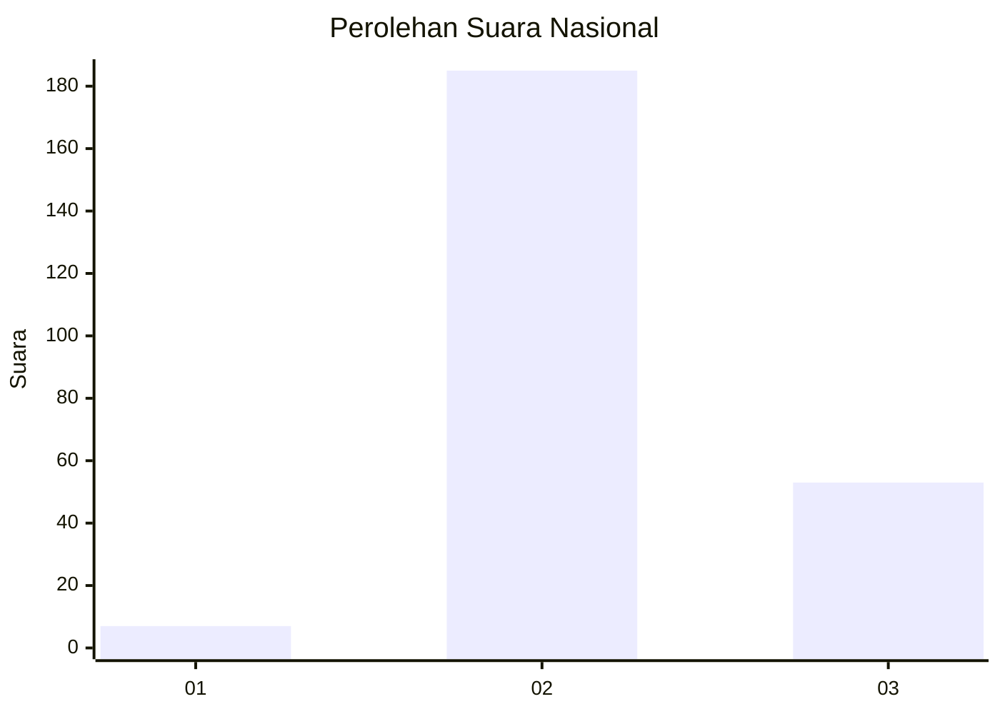

# Hasil

## Grafik

## Tabel

| No. | Nama Paslon    | Suara | Suara (raw) | Persentase |
|:--- |:-------------- | -----:| -----------:| ----------:|
| 1   | ANIES MUHAIMIN | 7     | [7][p-1]    | 2,86       |
| 2   | PRABOWO GIBRAN | 185   | [185][p-2]  | 75,51      |
| 3   | GANJAR MAHFUD  | 53    | [53][p-3]   | 21,63      |

[p-1]: https://github.com/gigit-pemilu/pemilu-2024/blob/main/pilpres/hitung-suara/sub/94-papua-tengah/sub/04-mimika/sub/01-mimika-baru/sub/1008-pasar-sentral/sub/011-tps/sub/paslon-1.txt
[p-2]: https://github.com/gigit-pemilu/pemilu-2024/blob/main/pilpres/hitung-suara/sub/94-papua-tengah/sub/04-mimika/sub/01-mimika-baru/sub/1008-pasar-sentral/sub/011-tps/sub/paslon-2.txt
[p-3]: https://github.com/gigit-pemilu/pemilu-2024/blob/main/pilpres/hitung-suara/sub/94-papua-tengah/sub/04-mimika/sub/01-mimika-baru/sub/1008-pasar-sentral/sub/011-tps/sub/paslon-3.txt

## Foto C Plano

https://sirekap-obj-formc.kpu.go.id/e61f/pemilu/ppwp/94/04/01/10/08/9404011008011-20240215-201430--781f88a4-4312-4c8e-821d-d2f081680245.jpg

https://sirekap-obj-formc.kpu.go.id/e61f/pemilu/ppwp/94/04/01/10/08/9404011008011-20240214-141455--43d7e5b5-34fd-41b7-ba58-3f7c3bdb46c6.jpg

https://sirekap-obj-formc.kpu.go.id/e61f/pemilu/ppwp/94/04/01/10/08/9404011008011-20240215-201317--ff18b7c8-a1b8-47aa-829c-edb0ac0655f1.jpg

## Metadata

| Key        | Value               |
| ---------- | ------------------- |
| Time Stamp | 2024-02-15 20:30:46 |

