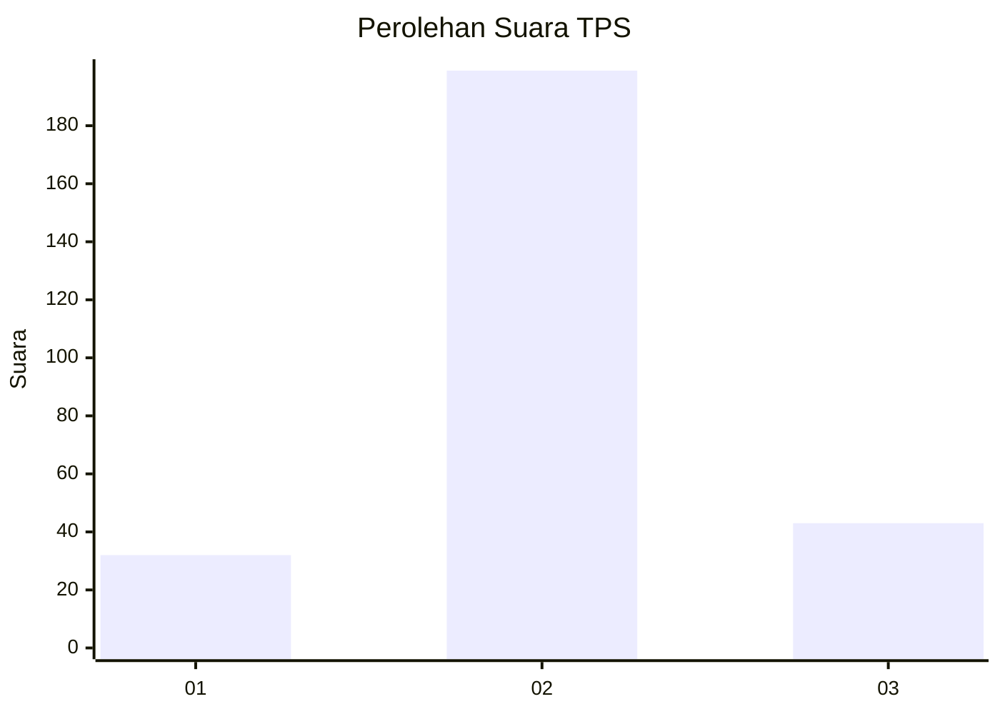
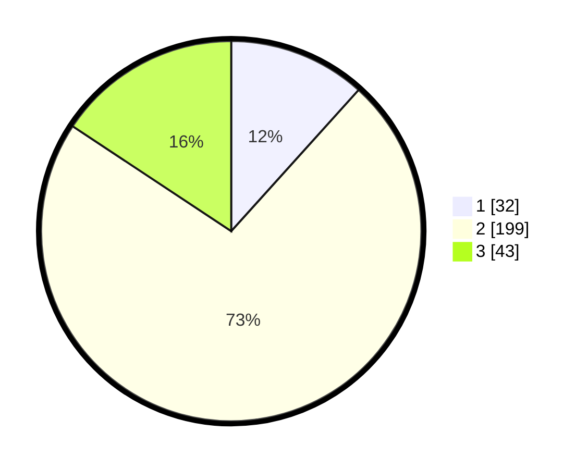

# Hasil

## Grafik

## Tabel

| No. | Nama Paslon    | Suara | Suara (raw) | Persentase |
|:--- |:-------------- | -----:| -----------:| ----------:|
| 1   | ANIES MUHAIMIN | 32    | [32][p-1]   | 11,68      |
| 2   | PRABOWO GIBRAN | 199   | [199][p-2]  | 72,63      |
| 3   | GANJAR MAHFUD  | 43    | [43][p-3]   | 15,69      |

[p-1]: https://github.com/gigit-pemilu/pemilu-2024-94-papua-tengah/blob/main/pilpres/hitung-suara/sub/94-papua-tengah/sub/04-mimika/sub/01-mimika-baru/sub/1008-pasar-sentral/sub/013-tps/sub/paslon-1.txt
[p-2]: https://github.com/gigit-pemilu/pemilu-2024-94-papua-tengah/blob/main/pilpres/hitung-suara/sub/94-papua-tengah/sub/04-mimika/sub/01-mimika-baru/sub/1008-pasar-sentral/sub/013-tps/sub/paslon-2.txt
[p-3]: https://github.com/gigit-pemilu/pemilu-2024-94-papua-tengah/blob/main/pilpres/hitung-suara/sub/94-papua-tengah/sub/04-mimika/sub/01-mimika-baru/sub/1008-pasar-sentral/sub/013-tps/sub/paslon-3.txt

## Foto C Plano

https://sirekap-obj-formc.kpu.go.id/2289/pemilu/ppwp/94/04/01/10/08/9404011008013-20240215-044915--3c1db7aa-c48f-489e-8710-5c19a4566e43.jpg

https://sirekap-obj-formc.kpu.go.id/2289/pemilu/ppwp/94/04/01/10/08/9404011008013-20240215-041949--efc5455f-dee3-4143-8c1c-658a630012c8.jpg

## Metadata

| Key        | Value               |
| ---------- | ------------------- |
| Time Stamp | 2024-02-15 21:01:18 |

