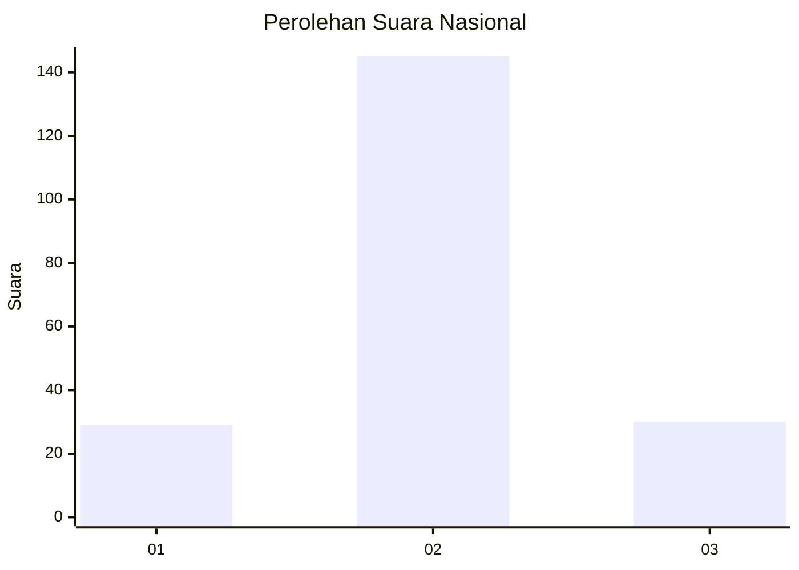

# Hasil

## Grafik

## Tabel

| No. | Nama Paslon    | Suara | Suara (raw) | Persentase |
|:--- |:-------------- | -----:| -----------:| ----------:|
| 1   | ANIES MUHAIMIN | 29    | [29][p-1]   | 14,22      |
| 2   | PRABOWO GIBRAN | 145   | [145][p-2]  | 71,08      |
| 3   | GANJAR MAHFUD  | 30    | [30][p-3]   | 14,71      |

[p-1]: https://github.com/gigit-pemilu/pemilu-2024/blob/main/pilpres/hitung-suara/sub/94-papua-tengah/sub/04-mimika/sub/01-mimika-baru/sub/1008-pasar-sentral/sub/022-tps/sub/paslon-1.txt
[p-2]: https://github.com/gigit-pemilu/pemilu-2024/blob/main/pilpres/hitung-suara/sub/94-papua-tengah/sub/04-mimika/sub/01-mimika-baru/sub/1008-pasar-sentral/sub/022-tps/sub/paslon-2.txt
[p-3]: https://github.com/gigit-pemilu/pemilu-2024/blob/main/pilpres/hitung-suara/sub/94-papua-tengah/sub/04-mimika/sub/01-mimika-baru/sub/1008-pasar-sentral/sub/022-tps/sub/paslon-3.txt

## Foto C Plano

https://sirekap-obj-formc.kpu.go.id/67e3/pemilu/ppwp/94/04/01/10/08/9404011008022-20240214-213316--48a64cae-2456-481a-9e46-87dc79191363.jpg

https://sirekap-obj-formc.kpu.go.id/67e3/pemilu/ppwp/94/04/01/10/08/9404011008022-20240214-213446--85c81f0f-8bf1-4c8a-ae8c-c751ea7b20fd.jpg

https://sirekap-obj-formc.kpu.go.id/67e3/pemilu/ppwp/94/04/01/10/08/9404011008022-20240214-213621--83443d0f-96f7-4c7f-b7e6-4b40d5768369.jpg

## Metadata

| Key        | Value               |
| ---------- | ------------------- |
| Time Stamp | 2024-02-25 22:00:00 |

