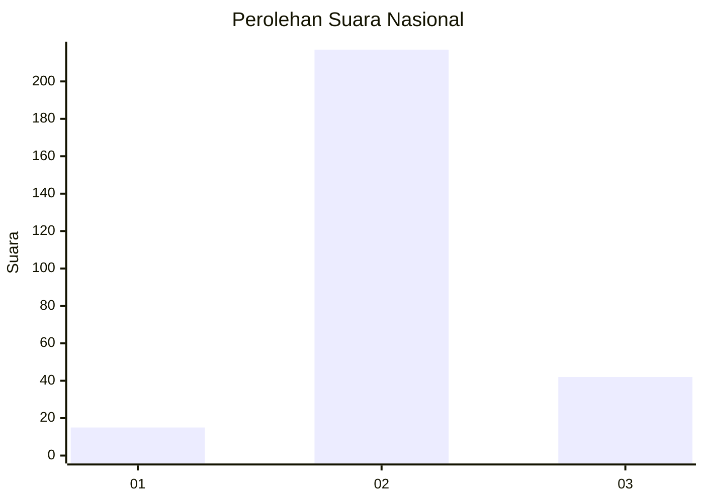

# Hasil

## Grafik

## Tabel

| No. | Nama Paslon    | Suara | Suara (raw) | Persentase |
|:--- |:-------------- | -----:| -----------:| ----------:|
| 1   | ANIES MUHAIMIN | 15    | [15][p-1]   | 5,47       |
| 2   | PRABOWO GIBRAN | 217   | [217][p-2]  | 79,20      |
| 3   | GANJAR MAHFUD  | 42    | [42][p-3]   | 15,33      |

[p-1]: https://github.com/gigit-pemilu/pemilu-2024/blob/main/pilpres/hitung-suara/sub/94-papua-tengah/sub/04-mimika/sub/01-mimika-baru/sub/1008-pasar-sentral/sub/031-tps/sub/paslon-1.txt
[p-2]: https://github.com/gigit-pemilu/pemilu-2024/blob/main/pilpres/hitung-suara/sub/94-papua-tengah/sub/04-mimika/sub/01-mimika-baru/sub/1008-pasar-sentral/sub/031-tps/sub/paslon-2.txt
[p-3]: https://github.com/gigit-pemilu/pemilu-2024/blob/main/pilpres/hitung-suara/sub/94-papua-tengah/sub/04-mimika/sub/01-mimika-baru/sub/1008-pasar-sentral/sub/031-tps/sub/paslon-3.txt

## Foto C Plano

https://sirekap-obj-formc.kpu.go.id/dbbe/pemilu/ppwp/94/04/01/10/08/9404011008031-20240214-204337--16270286-e7ed-494a-b8fc-f0895407fe83.jpg

https://sirekap-obj-formc.kpu.go.id/dbbe/pemilu/ppwp/94/04/01/10/08/9404011008031-20240214-204438--b66e807f-c44a-4e99-b37c-d22373cc4a2f.jpg

https://sirekap-obj-formc.kpu.go.id/dbbe/pemilu/ppwp/94/04/01/10/08/9404011008031-20240214-204524--7c9357eb-6303-4e4d-b0e2-fa09470e9d01.jpg

## Metadata

| Key        | Value               |
| ---------- | ------------------- |
| Time Stamp | 2024-02-15 20:30:46 |

