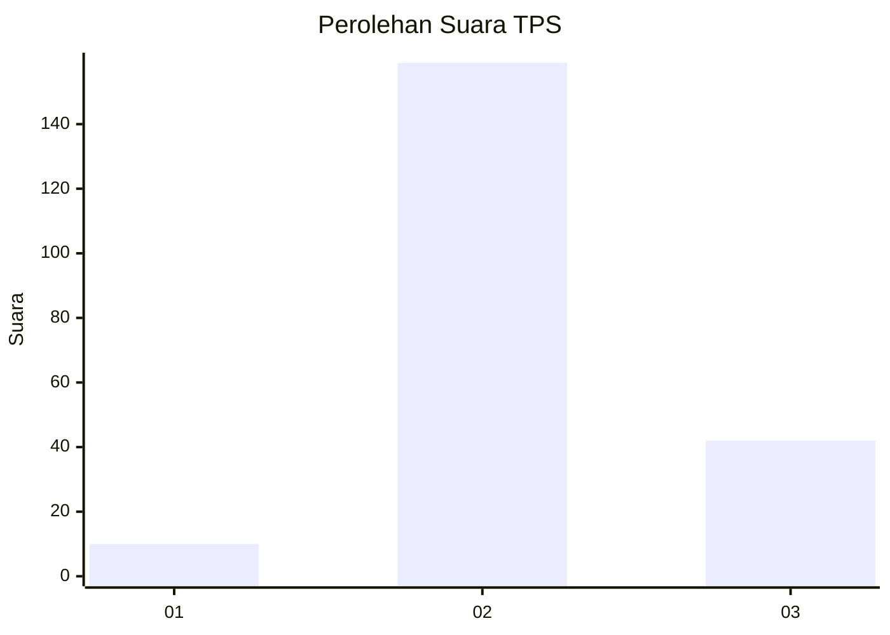

# Hasil

## Grafik

## Tabel

| No. | Nama Paslon    | Suara | Suara (raw) | Persentase |
|:--- |:-------------- | -----:| -----------:| ----------:|
| 1   | ANIES MUHAIMIN | 10    | [10][p-1]   | 4,74       |
| 2   | PRABOWO GIBRAN | 159   | [159][p-2]  | 75,36      |
| 3   | GANJAR MAHFUD  | 42    | [42][p-3]   | 19,91      |

[p-1]: https://github.com/gigit-pemilu/pemilu-2024-94-papua-tengah/blob/main/pilpres/hitung-suara/sub/94-papua-tengah/sub/04-mimika/sub/01-mimika-baru/sub/1010-kebun-sirih/sub/006-tps/sub/paslon-1.txt
[p-2]: https://github.com/gigit-pemilu/pemilu-2024-94-papua-tengah/blob/main/pilpres/hitung-suara/sub/94-papua-tengah/sub/04-mimika/sub/01-mimika-baru/sub/1010-kebun-sirih/sub/006-tps/sub/paslon-2.txt
[p-3]: https://github.com/gigit-pemilu/pemilu-2024-94-papua-tengah/blob/main/pilpres/hitung-suara/sub/94-papua-tengah/sub/04-mimika/sub/01-mimika-baru/sub/1010-kebun-sirih/sub/006-tps/sub/paslon-3.txt

## Foto C Plano

https://sirekap-obj-formc.kpu.go.id/4cb5/pemilu/ppwp/94/04/01/10/10/9404011010006-20240214-215129--0ac7efa5-075f-4541-8486-e46378e07f74.jpg

https://sirekap-obj-formc.kpu.go.id/4cb5/pemilu/ppwp/94/04/01/10/10/9404011010006-20240214-215330--04dd27e4-879d-44b5-9876-7609fc7e6b09.jpg

https://sirekap-obj-formc.kpu.go.id/4cb5/pemilu/ppwp/94/04/01/10/10/9404011010006-20240214-215823--29fca4bf-37b0-4068-83f6-cab25833bc58.jpg

## Metadata

| Key        | Value               |
| ---------- | ------------------- |
| Time Stamp | 2024-02-25 14:00:00 |

