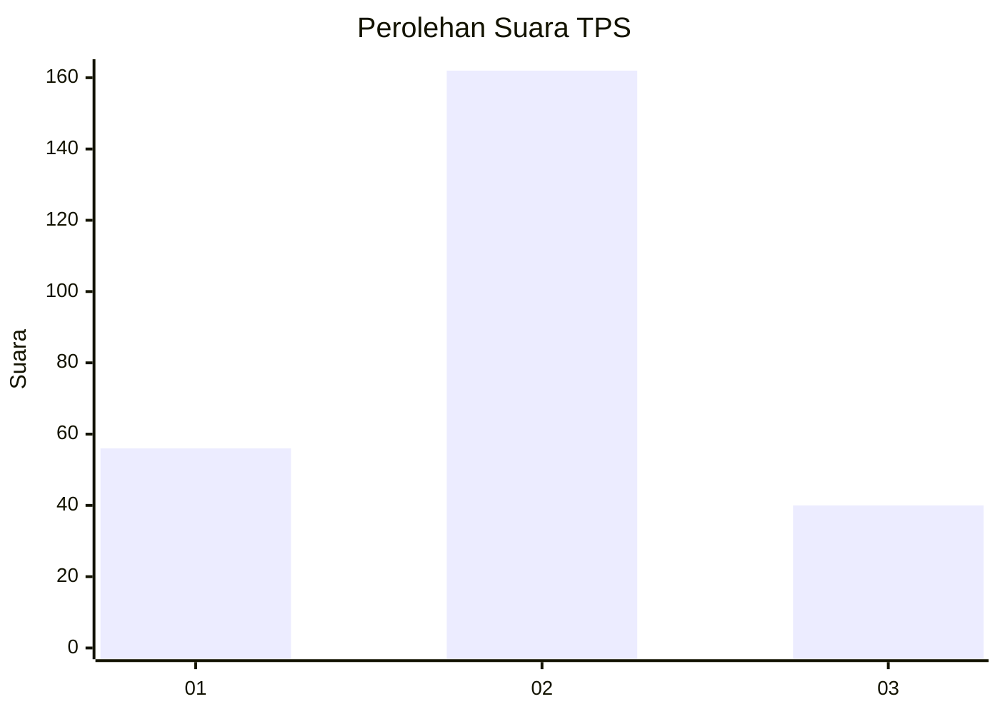
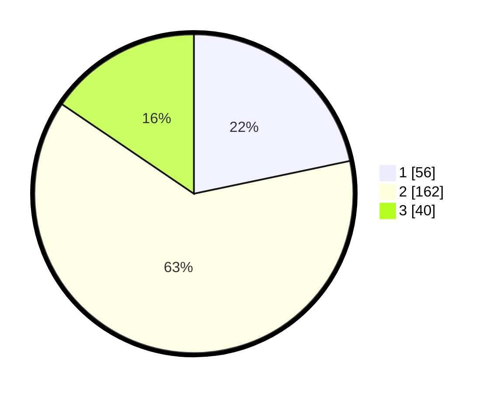

# Hasil

## Grafik

## Tabel

| No. | Nama Paslon    | Suara | Suara (raw) | Persentase |
|:--- |:-------------- | -----:| -----------:| ----------:|
| 1   | ANIES MUHAIMIN | 56    | [56][p-1]   | 21,71      |
| 2   | PRABOWO GIBRAN | 162   | [162][p-2]  | 62,79      |
| 3   | GANJAR MAHFUD  | 40    | [40][p-3]   | 15,50      |

[p-1]: https://github.com/gigit-pemilu/pemilu-2024-94-papua-tengah/blob/main/pilpres/hitung-suara/sub/94-papua-tengah/sub/04-mimika/sub/01-mimika-baru/sub/1010-kebun-sirih/sub/014-tps/sub/paslon-1.txt
[p-2]: https://github.com/gigit-pemilu/pemilu-2024-94-papua-tengah/blob/main/pilpres/hitung-suara/sub/94-papua-tengah/sub/04-mimika/sub/01-mimika-baru/sub/1010-kebun-sirih/sub/014-tps/sub/paslon-2.txt
[p-3]: https://github.com/gigit-pemilu/pemilu-2024-94-papua-tengah/blob/main/pilpres/hitung-suara/sub/94-papua-tengah/sub/04-mimika/sub/01-mimika-baru/sub/1010-kebun-sirih/sub/014-tps/sub/paslon-3.txt

## Foto C Plano

https://sirekap-obj-formc.kpu.go.id/1462/pemilu/ppwp/94/04/01/10/10/9404011010014-20240214-234646--e8295137-4825-41a0-9990-2e1453e04524.jpg

https://sirekap-obj-formc.kpu.go.id/1462/pemilu/ppwp/94/04/01/10/10/9404011010014-20240214-224011--54e7979b-83e4-4ace-8406-ead7c5129b07.jpg

## Metadata

| Key        | Value               |
| ---------- | ------------------- |
| Time Stamp | 2024-02-22 11:00:00 |

