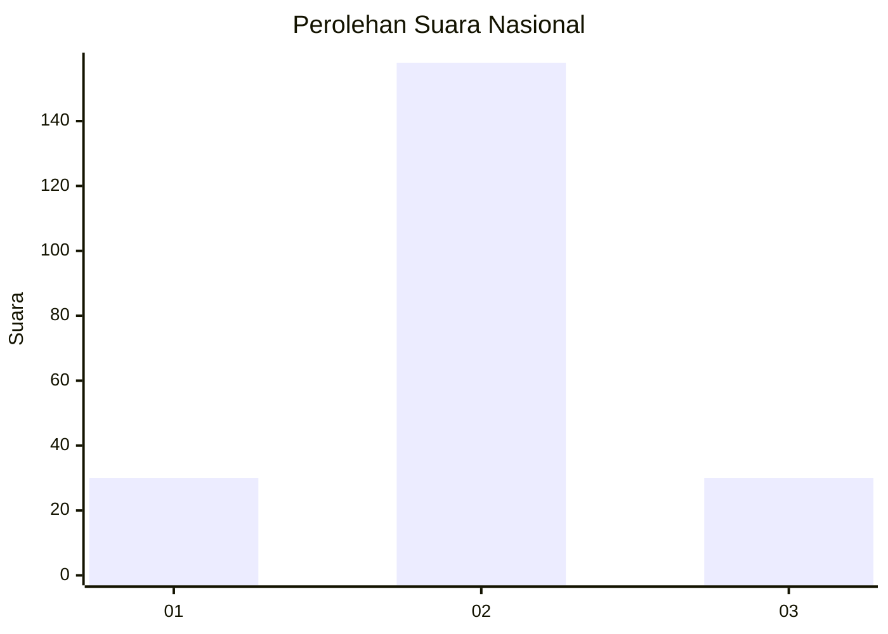
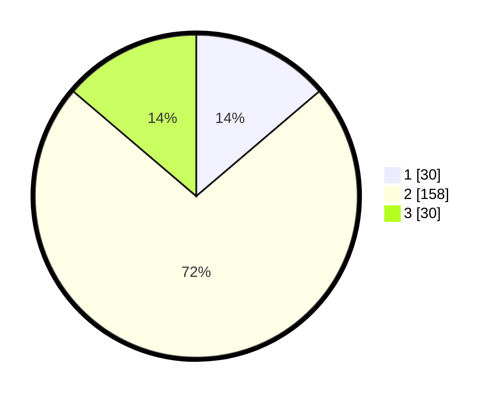

# Hasil

## Grafik

## Tabel

| No. | Nama Paslon    | Suara | Suara (raw) | Persentase |
|:--- |:-------------- | -----:| -----------:| ----------:|
| 1   | ANIES MUHAIMIN | 30    | [30][p-1]   | 13,76      |
| 2   | PRABOWO GIBRAN | 158   | [158][p-2]  | 72,48      |
| 3   | GANJAR MAHFUD  | 30    | [30][p-3]   | 13,76      |

[p-1]: https://github.com/gigit-pemilu/pemilu-2024/blob/main/pilpres/hitung-suara/sub/94-papua-tengah/sub/04-mimika/sub/01-mimika-baru/sub/1011-otomona/sub/003-tps/sub/paslon-1.txt
[p-2]: https://github.com/gigit-pemilu/pemilu-2024/blob/main/pilpres/hitung-suara/sub/94-papua-tengah/sub/04-mimika/sub/01-mimika-baru/sub/1011-otomona/sub/003-tps/sub/paslon-2.txt
[p-3]: https://github.com/gigit-pemilu/pemilu-2024/blob/main/pilpres/hitung-suara/sub/94-papua-tengah/sub/04-mimika/sub/01-mimika-baru/sub/1011-otomona/sub/003-tps/sub/paslon-3.txt

## Foto C Plano

https://sirekap-obj-formc.kpu.go.id/98b9/pemilu/ppwp/94/04/01/10/11/9404011011003-20240219-172920--f8dad0cc-6fcd-4d9b-a1e5-528ef6ee411a.jpg

https://sirekap-obj-formc.kpu.go.id/98b9/pemilu/ppwp/94/04/01/10/11/9404011011003-20240219-172921--dbf36e18-3691-4116-8a3f-4a968c093de8.jpg

https://sirekap-obj-formc.kpu.go.id/98b9/pemilu/ppwp/94/04/01/10/11/9404011011003-20240219-172921--b5f594c9-c1ed-45ba-9f90-2e58e9bc8a38.jpg

## Metadata

| Key        | Value               |
| ---------- | ------------------- |
| Time Stamp | 2024-02-22 12:00:00 |

## DATA PEMILIH TETAP

Jumlah pemilih dalam DPT: **220**.
 * L: **118**.
 * P: **102**.

## DATA PENGGUNA HAK PILIH

Jumlah pengguna hak pilih dalam DPT: **203**.
 * L: **112**.
 * P: **91**.

Jumlah pengguna hak pilih dalam DPTb: **0**.
 * L: **0**.
 * P: **0**.

Jumlah pengguna hak pilih dalam DPK: **22**.
 * L: **13**.
 * P: **9**.

Jumlah pengguna hak pilih: **225**.
 * L: **125**.
 * P: **100**.

## JUMLAH SUARA SAH DAN TIDAK SAH

JUMLAH SELURUH SUARA SAH: **218**.

JUMLAH SUARA TIDAK SAH: **7**.

JUMLAH SELURUH SUARA SAH DAN SUARA TIDAK SAH: **225**.

