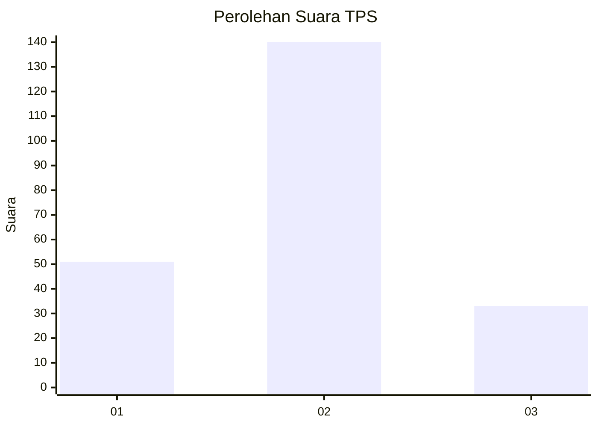
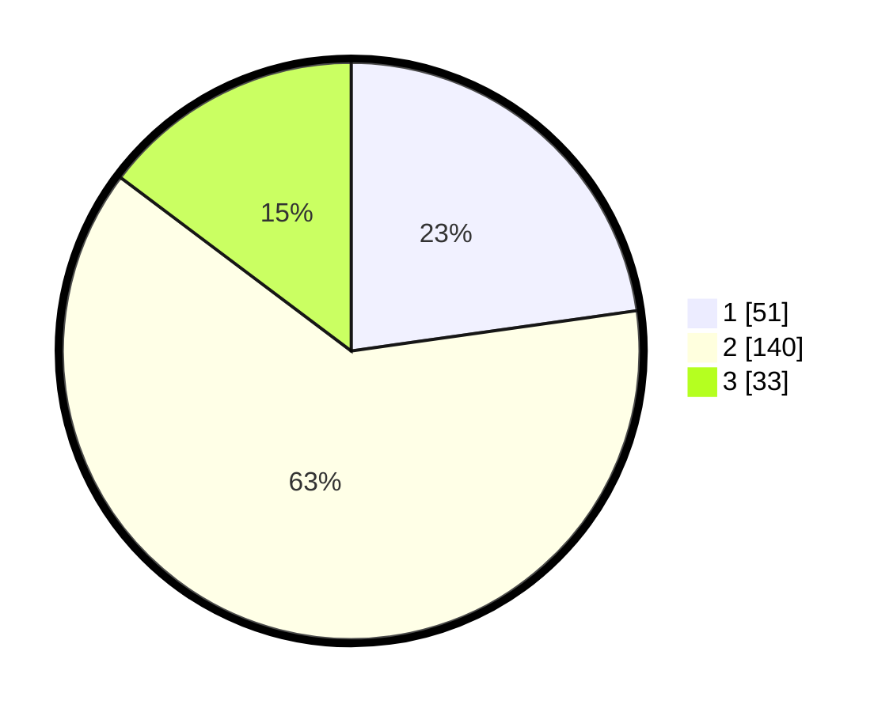

# Hasil

## Grafik

## Tabel

| No. | Nama Paslon    | Suara | Suara (raw) | Persentase |
|:--- |:-------------- | -----:| -----------:| ----------:|
| 1   | ANIES MUHAIMIN | 51    | [51][p-1]   | 22,77      |
| 2   | PRABOWO GIBRAN | 140   | [140][p-2]  | 62,50      |
| 3   | GANJAR MAHFUD  | 33    | [33][p-3]   | 14,73      |

[p-1]: https://github.com/gigit-pemilu/pemilu-2024-94-papua-tengah/blob/main/pilpres/hitung-suara/sub/94-papua-tengah/sub/04-mimika/sub/01-mimika-baru/sub/1011-otomona/sub/037-tps/sub/paslon-1.txt
[p-2]: https://github.com/gigit-pemilu/pemilu-2024-94-papua-tengah/blob/main/pilpres/hitung-suara/sub/94-papua-tengah/sub/04-mimika/sub/01-mimika-baru/sub/1011-otomona/sub/037-tps/sub/paslon-2.txt
[p-3]: https://github.com/gigit-pemilu/pemilu-2024-94-papua-tengah/blob/main/pilpres/hitung-suara/sub/94-papua-tengah/sub/04-mimika/sub/01-mimika-baru/sub/1011-otomona/sub/037-tps/sub/paslon-3.txt

## Foto C Plano

https://sirekap-obj-formc.kpu.go.id/920f/pemilu/ppwp/94/04/01/10/11/9404011011037-20240216-144202--1d296b6a-f34e-4788-b76e-1cc3f23b56ff.jpg

https://sirekap-obj-formc.kpu.go.id/920f/pemilu/ppwp/94/04/01/10/11/9404011011037-20240216-144352--78641701-f418-458e-b918-486ee3117584.jpg

## Metadata

| Key        | Value               |
| ---------- | ------------------- |
| Time Stamp | 2024-02-25 11:00:00 |

