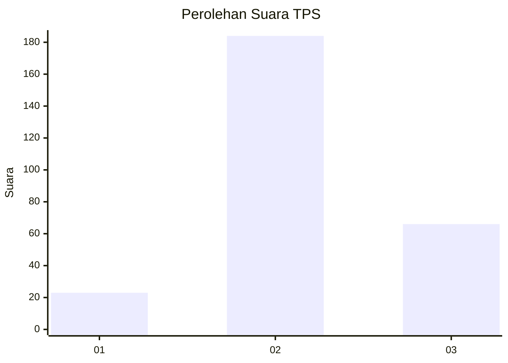
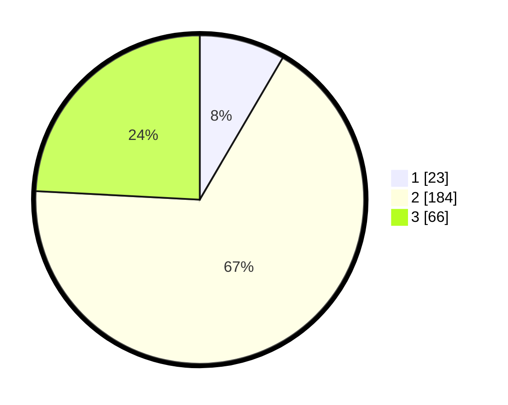

# Hasil

## Grafik

## Tabel

| No. | Nama Paslon    | Suara | Suara (raw) | Persentase |
|:--- |:-------------- | -----:| -----------:| ----------:|
| 1   | ANIES MUHAIMIN | 23    | [23][p-1]   | 8,42       |
| 2   | PRABOWO GIBRAN | 184   | [184][p-2]  | 67,40      |
| 3   | GANJAR MAHFUD  | 66    | [66][p-3]   | 24,18      |

[p-1]: https://github.com/gigit-pemilu/pemilu-2024-94-papua-tengah/blob/main/pilpres/hitung-suara/sub/94-papua-tengah/sub/04-mimika/sub/01-mimika-baru/sub/1012-perintis/sub/004-tps/sub/paslon-1.txt
[p-2]: https://github.com/gigit-pemilu/pemilu-2024-94-papua-tengah/blob/main/pilpres/hitung-suara/sub/94-papua-tengah/sub/04-mimika/sub/01-mimika-baru/sub/1012-perintis/sub/004-tps/sub/paslon-2.txt
[p-3]: https://github.com/gigit-pemilu/pemilu-2024-94-papua-tengah/blob/main/pilpres/hitung-suara/sub/94-papua-tengah/sub/04-mimika/sub/01-mimika-baru/sub/1012-perintis/sub/004-tps/sub/paslon-3.txt

## Foto C Plano

https://sirekap-obj-formc.kpu.go.id/3b1b/pemilu/ppwp/94/04/01/10/12/9404011012004-20240216-141848--ca72e0da-016c-4f82-a9f9-055c9e374599.jpg

https://sirekap-obj-formc.kpu.go.id/3b1b/pemilu/ppwp/94/04/01/10/12/9404011012004-20240216-141849--214faf28-dd94-4a95-9600-7920e87f0a76.jpg

https://sirekap-obj-formc.kpu.go.id/3b1b/pemilu/ppwp/94/04/01/10/12/9404011012004-20240216-141848--004c8dde-8d29-4abe-b448-d08c11139fda.jpg

## Metadata

| Key        | Value               |
| ---------- | ------------------- |
| Time Stamp | 2024-02-21 22:00:00 |

## DATA PEMILIH TETAP

Jumlah pemilih dalam DPT: **280**.
 * L: **153**.
 * P: **127**.

## DATA PENGGUNA HAK PILIH

Jumlah pengguna hak pilih dalam DPT: **135**.
 * L: **70**.
 * P: **65**.

Jumlah pengguna hak pilih dalam DPTb: **145**.
 * L: **73**.
 * P: **72**.

Jumlah pengguna hak pilih dalam DPK: **0**.
 * L: **0**.
 * P: **0**.

Jumlah pengguna hak pilih: **280**.
 * L: **143**.
 * P: **137**.

## JUMLAH SUARA SAH DAN TIDAK SAH

JUMLAH SELURUH SUARA SAH: **273**.

JUMLAH SUARA TIDAK SAH: **7**.

JUMLAH SELURUH SUARA SAH DAN SUARA TIDAK SAH: **280**.

