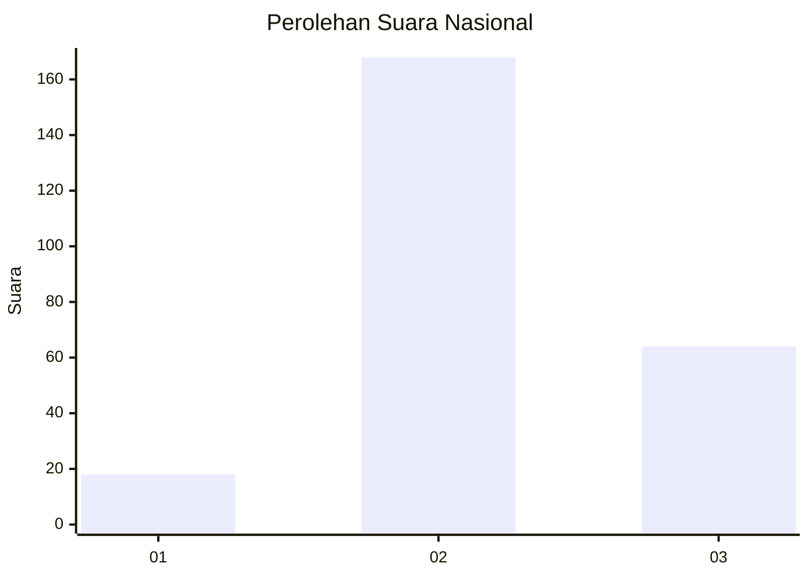
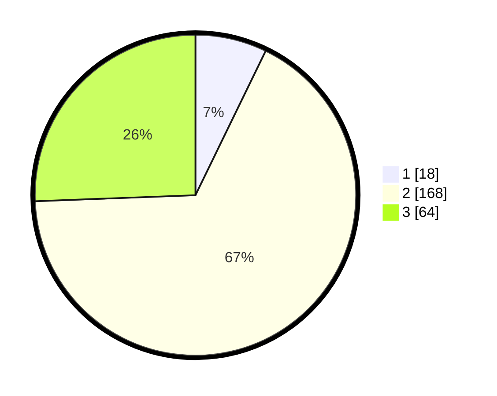

# Hasil

## Grafik

## Tabel

| No. | Nama Paslon    | Suara | Suara (raw) | Persentase |
|:--- |:-------------- | -----:| -----------:| ----------:|
| 1   | ANIES MUHAIMIN | 18    | [18][p-1]   | 7,20       |
| 2   | PRABOWO GIBRAN | 168   | [168][p-2]  | 67,20      |
| 3   | GANJAR MAHFUD  | 64    | [64][p-3]   | 25,60      |

[p-1]: https://github.com/gigit-pemilu/pemilu-2024/blob/main/pilpres/hitung-suara/sub/94-papua-tengah/sub/04-mimika/sub/01-mimika-baru/sub/1012-perintis/sub/006-tps/sub/paslon-1.txt
[p-2]: https://github.com/gigit-pemilu/pemilu-2024/blob/main/pilpres/hitung-suara/sub/94-papua-tengah/sub/04-mimika/sub/01-mimika-baru/sub/1012-perintis/sub/006-tps/sub/paslon-2.txt
[p-3]: https://github.com/gigit-pemilu/pemilu-2024/blob/main/pilpres/hitung-suara/sub/94-papua-tengah/sub/04-mimika/sub/01-mimika-baru/sub/1012-perintis/sub/006-tps/sub/paslon-3.txt

## Foto C Plano

https://sirekap-obj-formc.kpu.go.id/4c9b/pemilu/ppwp/94/04/01/10/12/9404011012006-20240215-053043--c51907ca-fb92-433d-b182-dcd1a2a03e88.jpg

https://sirekap-obj-formc.kpu.go.id/4c9b/pemilu/ppwp/94/04/01/10/12/9404011012006-20240214-155707--97d3c497-d255-4f51-ade4-73bf0e82cb41.jpg

https://sirekap-obj-formc.kpu.go.id/4c9b/pemilu/ppwp/94/04/01/10/12/9404011012006-20240215-053119--e5f69b1a-0e18-45f3-8db0-4dfb33bf032f.jpg

## Metadata

| Key        | Value               |
| ---------- | ------------------- |
| Time Stamp | 2024-02-24 22:31:28 |

