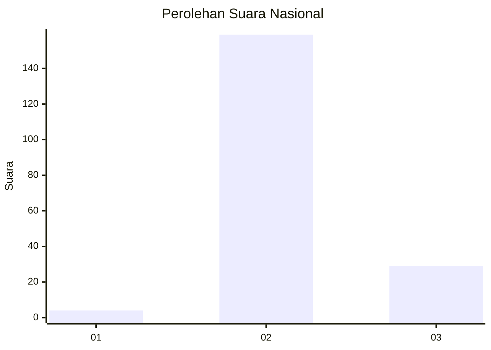
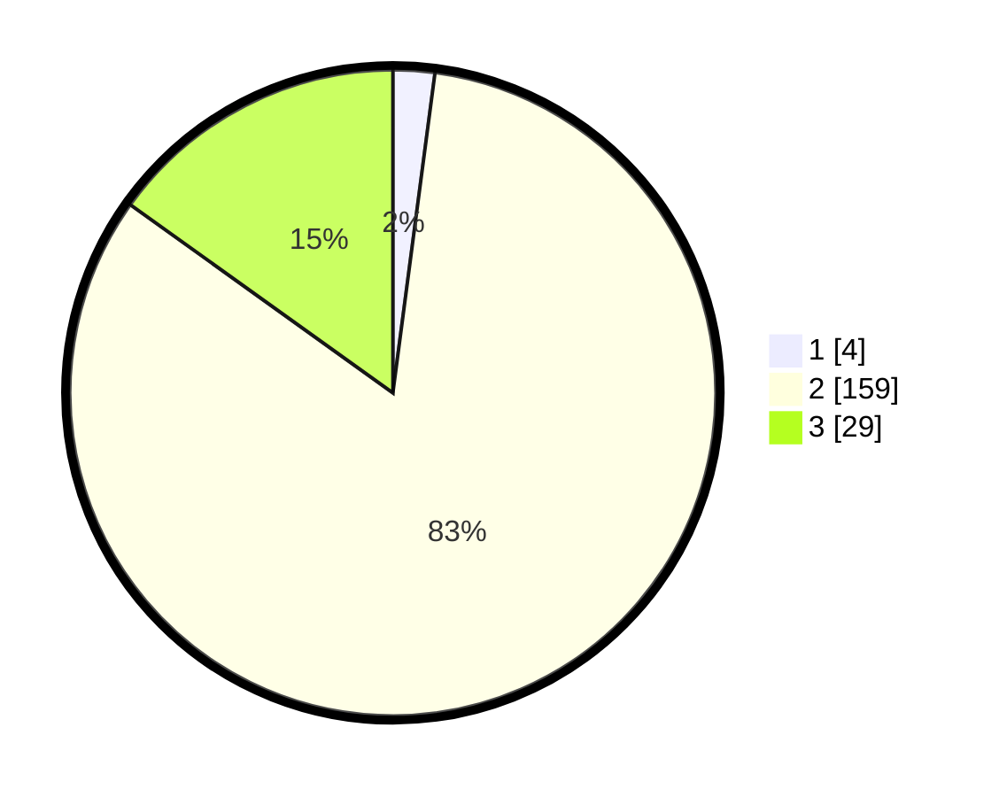

# Hasil

## Grafik

## Tabel

| No. | Nama Paslon    | Suara | Suara (raw) | Persentase |
|:--- |:-------------- | -----:| -----------:| ----------:|
| 1   | ANIES MUHAIMIN | 4     | [4][p-1]    | 2,08       |
| 2   | PRABOWO GIBRAN | 159   | [159][p-2]  | 82,81      |
| 3   | GANJAR MAHFUD  | 29    | [29][p-3]   | 15,10      |

[p-1]: https://github.com/gigit-pemilu/pemilu-2024/blob/main/pilpres/hitung-suara/sub/94-papua-tengah/sub/04-mimika/sub/01-mimika-baru/sub/1012-perintis/sub/008-tps/sub/paslon-1.txt
[p-2]: https://github.com/gigit-pemilu/pemilu-2024/blob/main/pilpres/hitung-suara/sub/94-papua-tengah/sub/04-mimika/sub/01-mimika-baru/sub/1012-perintis/sub/008-tps/sub/paslon-2.txt
[p-3]: https://github.com/gigit-pemilu/pemilu-2024/blob/main/pilpres/hitung-suara/sub/94-papua-tengah/sub/04-mimika/sub/01-mimika-baru/sub/1012-perintis/sub/008-tps/sub/paslon-3.txt

## Foto C Plano

https://sirekap-obj-formc.kpu.go.id/67bb/pemilu/ppwp/94/04/01/10/12/9404011012008-20240214-221847--c435e26b-1a69-4429-997d-02e6ee6098eb.jpg

https://sirekap-obj-formc.kpu.go.id/67bb/pemilu/ppwp/94/04/01/10/12/9404011012008-20240214-233012--07747447-243c-416c-94d0-ef74c7029a43.jpg

https://sirekap-obj-formc.kpu.go.id/67bb/pemilu/ppwp/94/04/01/10/12/9404011012008-20240214-233148--e3a3952a-644d-418a-896b-fdcb7908b34f.jpg

## Metadata

| Key        | Value               |
| ---------- | ------------------- |
| Time Stamp | 2024-02-15 21:01:18 |

