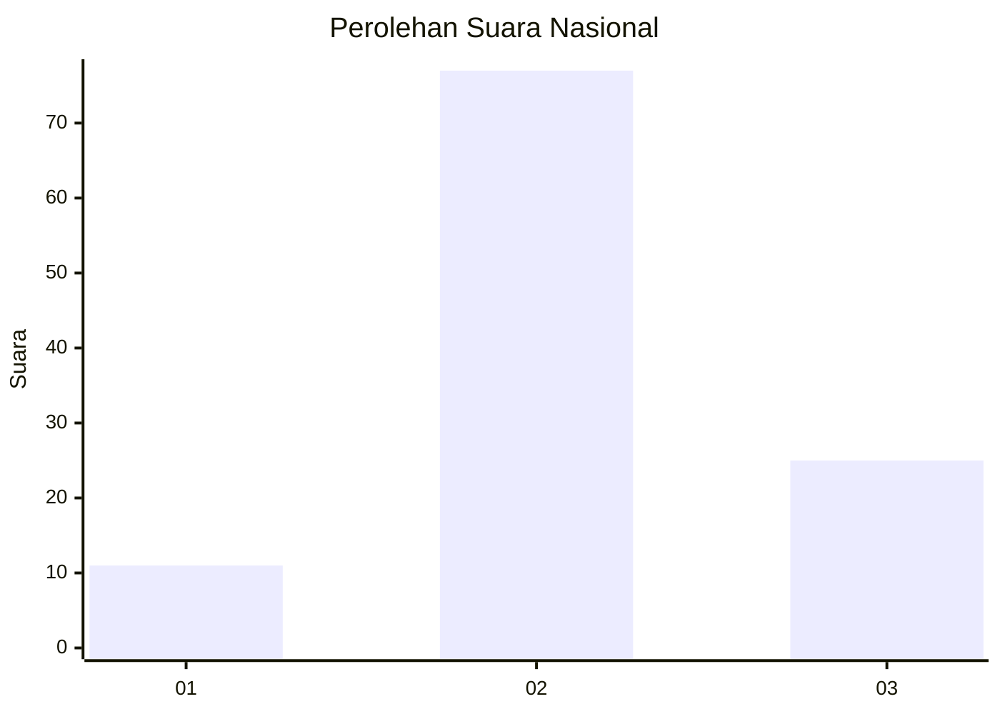
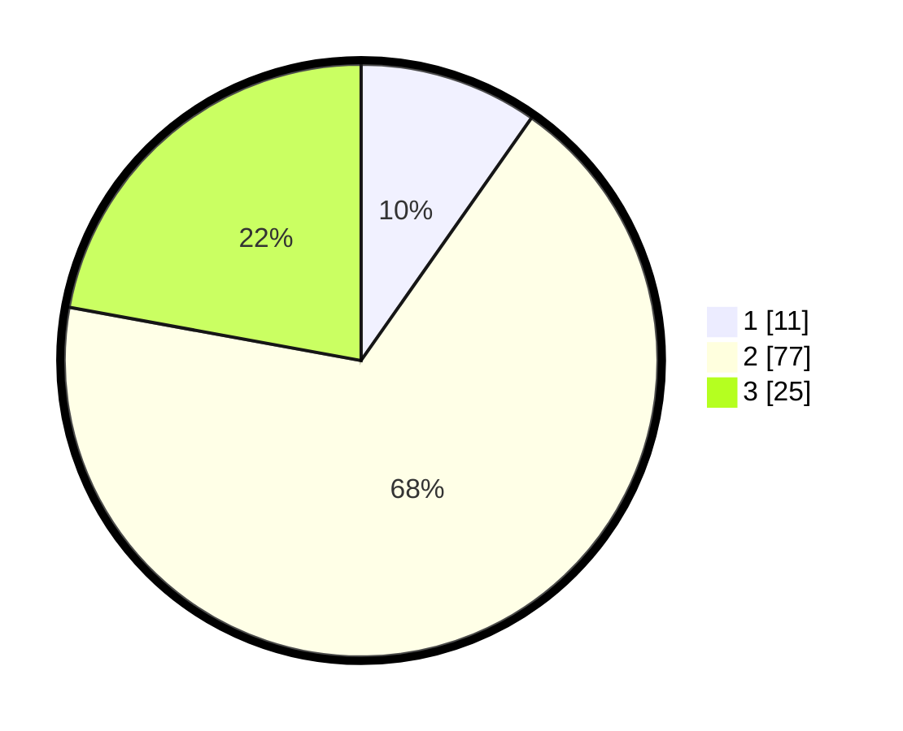

# Hasil

## Grafik

## Tabel

| No. | Nama Paslon    | Suara | Suara (raw) | Persentase |
|:--- |:-------------- | -----:| -----------:| ----------:|
| 1   | ANIES MUHAIMIN | 11    | [11][p-1]   | 9,73       |
| 2   | PRABOWO GIBRAN | 77    | [77][p-2]   | 68,14      |
| 3   | GANJAR MAHFUD  | 25    | [25][p-3]   | 22,12      |

[p-1]: https://github.com/gigit-pemilu/pemilu-2024/blob/main/pilpres/hitung-suara/sub/94-papua-tengah/sub/04-mimika/sub/01-mimika-baru/sub/1012-perintis/sub/010-tps/sub/paslon-1.txt
[p-2]: https://github.com/gigit-pemilu/pemilu-2024/blob/main/pilpres/hitung-suara/sub/94-papua-tengah/sub/04-mimika/sub/01-mimika-baru/sub/1012-perintis/sub/010-tps/sub/paslon-2.txt
[p-3]: https://github.com/gigit-pemilu/pemilu-2024/blob/main/pilpres/hitung-suara/sub/94-papua-tengah/sub/04-mimika/sub/01-mimika-baru/sub/1012-perintis/sub/010-tps/sub/paslon-3.txt

## Foto C Plano

https://sirekap-obj-formc.kpu.go.id/e842/pemilu/ppwp/94/04/01/10/12/9404011012010-20240214-193112--8da232da-2050-4efe-8a47-17d225c7aeb9.jpg

https://sirekap-obj-formc.kpu.go.id/e842/pemilu/ppwp/94/04/01/10/12/9404011012010-20240215-194701--882a57cf-4301-4846-a933-d39d59bc73ad.jpg

https://sirekap-obj-formc.kpu.go.id/e842/pemilu/ppwp/94/04/01/10/12/9404011012010-20240215-194650--c4f64121-e494-418f-8c60-0a707f533179.jpg

## Metadata

| Key        | Value               |
| ---------- | ------------------- |
| Time Stamp | 2024-02-15 20:30:46 |

## DATA PEMILIH TETAP

Jumlah pemilih dalam DPT: **262**.
 * L: **145**.
 * P: **117**.

## DATA PENGGUNA HAK PILIH

Jumlah pengguna hak pilih dalam DPT: **67**.
 * L: **37**.
 * P: **30**.

Jumlah pengguna hak pilih dalam DPTb: **0**.
 * L: **0**.
 * P: **0**.

Jumlah pengguna hak pilih dalam DPK: **46**.
 * L: **23**.
 * P: **23**.

Jumlah pengguna hak pilih: **113**.
 * L: **60**.
 * P: **53**.

## JUMLAH SUARA SAH DAN TIDAK SAH

JUMLAH SELURUH SUARA SAH: **113**.

JUMLAH SUARA TIDAK SAH: **155**.

JUMLAH SELURUH SUARA SAH DAN SUARA TIDAK SAH: **268**.

