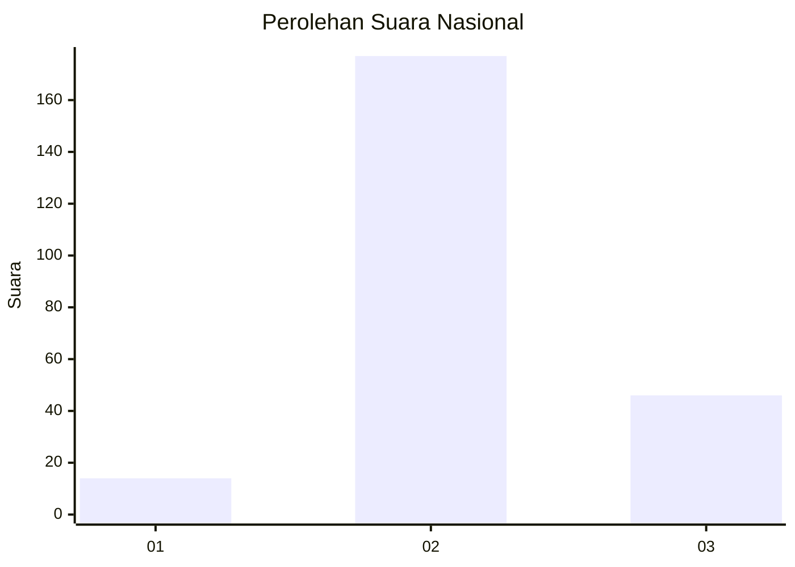
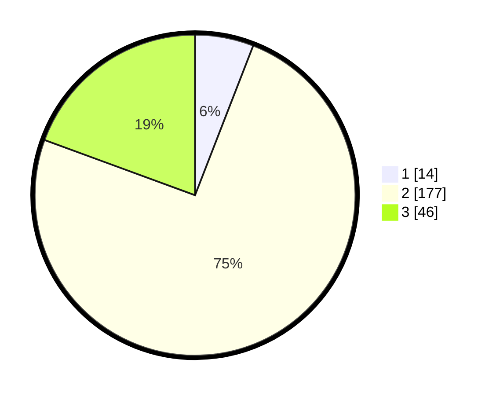

# Hasil

## Grafik

## Tabel

| No. | Nama Paslon    | Suara | Suara (raw) | Persentase |
|:--- |:-------------- | -----:| -----------:| ----------:|
| 1   | ANIES MUHAIMIN | 14    | [14][p-1]   | 5,91       |
| 2   | PRABOWO GIBRAN | 177   | [177][p-2]  | 74,68      |
| 3   | GANJAR MAHFUD  | 46    | [46][p-3]   | 19,41      |

[p-1]: https://github.com/gigit-pemilu/pemilu-2024/blob/main/pilpres/hitung-suara/sub/94-papua-tengah/sub/04-mimika/sub/01-mimika-baru/sub/1012-perintis/sub/012-tps/sub/paslon-1.txt
[p-2]: https://github.com/gigit-pemilu/pemilu-2024/blob/main/pilpres/hitung-suara/sub/94-papua-tengah/sub/04-mimika/sub/01-mimika-baru/sub/1012-perintis/sub/012-tps/sub/paslon-2.txt
[p-3]: https://github.com/gigit-pemilu/pemilu-2024/blob/main/pilpres/hitung-suara/sub/94-papua-tengah/sub/04-mimika/sub/01-mimika-baru/sub/1012-perintis/sub/012-tps/sub/paslon-3.txt

## Foto C Plano

https://sirekap-obj-formc.kpu.go.id/d766/pemilu/ppwp/94/04/01/10/12/9404011012012-20240214-224350--423a6d1e-b459-4456-85ff-7c5c3f7fdd60.jpg

https://sirekap-obj-formc.kpu.go.id/d766/pemilu/ppwp/94/04/01/10/12/9404011012012-20240214-224428--491c33a8-0d55-4b2c-8638-ff48f5c74633.jpg

https://sirekap-obj-formc.kpu.go.id/d766/pemilu/ppwp/94/04/01/10/12/9404011012012-20240214-224509--e97b0ef9-73ec-41b0-86c6-e9675fd76d45.jpg

## Metadata

| Key        | Value               |
| ---------- | ------------------- |
| Time Stamp | 2024-02-15 21:01:18 |

