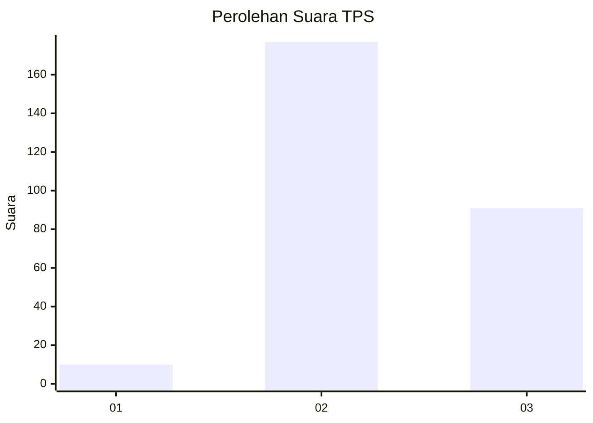
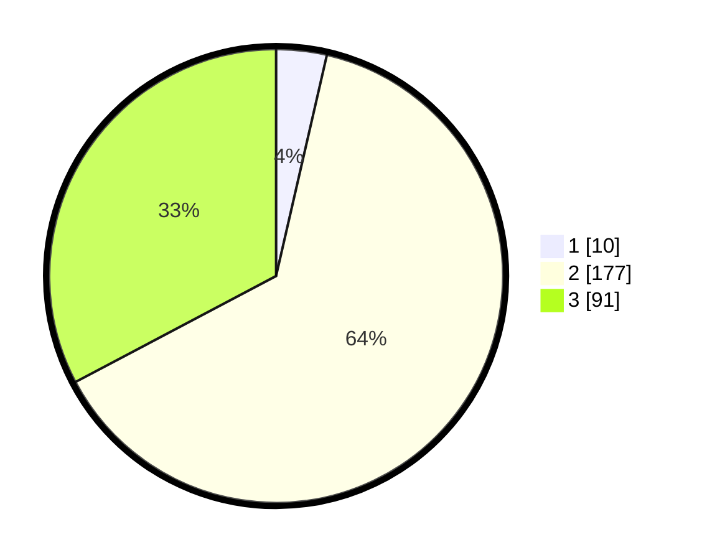

# Hasil

## Grafik

## Tabel

| No. | Nama Paslon    | Suara | Suara (raw) | Persentase |
|:--- |:-------------- | -----:| -----------:| ----------:|
| 1   | ANIES MUHAIMIN | 10    | [10][p-1]   | 3,60       |
| 2   | PRABOWO GIBRAN | 177   | [177][p-2]  | 63,67      |
| 3   | GANJAR MAHFUD  | 91    | [91][p-3]   | 32,73      |

[p-1]: https://github.com/gigit-pemilu/pemilu-2024-94-papua-tengah/blob/main/pilpres/hitung-suara/sub/94-papua-tengah/sub/04-mimika/sub/01-mimika-baru/sub/1012-perintis/sub/016-tps/sub/paslon-1.txt
[p-2]: https://github.com/gigit-pemilu/pemilu-2024-94-papua-tengah/blob/main/pilpres/hitung-suara/sub/94-papua-tengah/sub/04-mimika/sub/01-mimika-baru/sub/1012-perintis/sub/016-tps/sub/paslon-2.txt
[p-3]: https://github.com/gigit-pemilu/pemilu-2024-94-papua-tengah/blob/main/pilpres/hitung-suara/sub/94-papua-tengah/sub/04-mimika/sub/01-mimika-baru/sub/1012-perintis/sub/016-tps/sub/paslon-3.txt

## Foto C Plano

https://sirekap-obj-formc.kpu.go.id/44e9/pemilu/ppwp/94/04/01/10/12/9404011012016-20240215-050705--43133fc2-75d0-4708-8366-2c7a4010c405.jpg

https://sirekap-obj-formc.kpu.go.id/44e9/pemilu/ppwp/94/04/01/10/12/9404011012016-20240215-050729--9316d653-4fe1-4d9b-979d-6dff91fcf085.jpg

https://sirekap-obj-formc.kpu.go.id/44e9/pemilu/ppwp/94/04/01/10/12/9404011012016-20240218-013811--57275ac3-e9a1-49cd-baad-18954dd89e82.jpg

## Metadata

| Key        | Value               |
| ---------- | ------------------- |
| Time Stamp | 2024-02-25 00:00:00 |

## DATA PEMILIH TETAP

Jumlah pemilih dalam DPT: **289**.
 * L: **149**.
 * P: **140**.

## DATA PENGGUNA HAK PILIH

Jumlah pengguna hak pilih dalam DPT: **289**.
 * L: **149**.
 * P: **140**.

Jumlah pengguna hak pilih dalam DPTb: **289**.
 * L: **149**.
 * P: **140**.

Jumlah pengguna hak pilih dalam DPK: **289**.
 * L: **149**.
 * P: **140**.

Jumlah pengguna hak pilih: **289**.
 * L: **149**.
 * P: **140**.

## JUMLAH SUARA SAH DAN TIDAK SAH

JUMLAH SELURUH SUARA SAH: **278**.

JUMLAH SUARA TIDAK SAH: **17**.

JUMLAH SELURUH SUARA SAH DAN SUARA TIDAK SAH: **295**.

