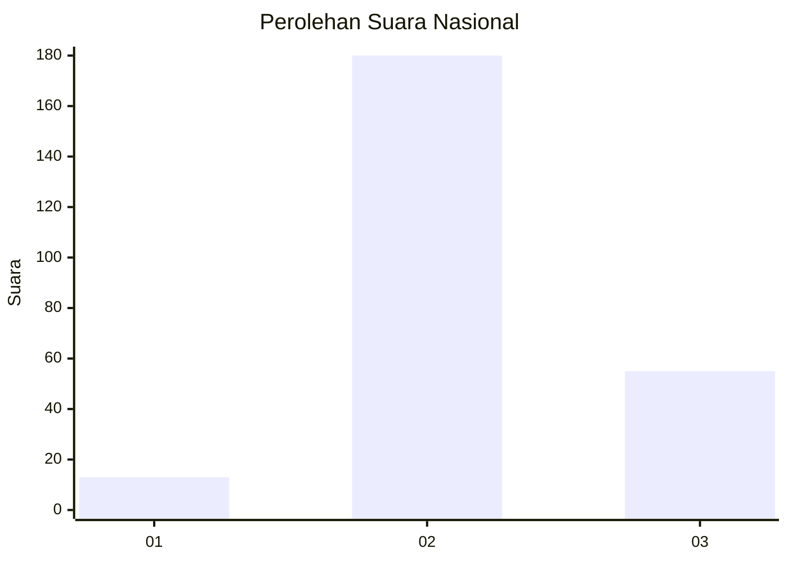
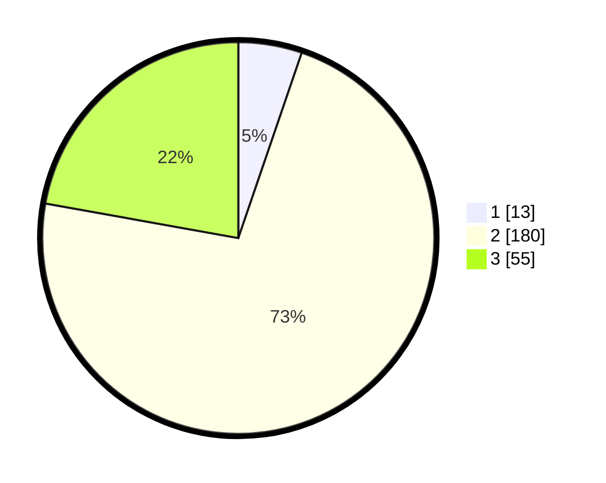

# Hasil

## Grafik

## Tabel

| No. | Nama Paslon    | Suara | Suara (raw) | Persentase |
|:--- |:-------------- | -----:| -----------:| ----------:|
| 1   | ANIES MUHAIMIN | 13    | [13][p-1]   | 5,24       |
| 2   | PRABOWO GIBRAN | 180   | [180][p-2]  | 72,58      |
| 3   | GANJAR MAHFUD  | 55    | [55][p-3]   | 22,18      |

[p-1]: https://github.com/gigit-pemilu/pemilu-2024/blob/main/pilpres/hitung-suara/sub/94-papua-tengah/sub/04-mimika/sub/01-mimika-baru/sub/1014-timika-indah/sub/007-tps/sub/paslon-1.txt
[p-2]: https://github.com/gigit-pemilu/pemilu-2024/blob/main/pilpres/hitung-suara/sub/94-papua-tengah/sub/04-mimika/sub/01-mimika-baru/sub/1014-timika-indah/sub/007-tps/sub/paslon-2.txt
[p-3]: https://github.com/gigit-pemilu/pemilu-2024/blob/main/pilpres/hitung-suara/sub/94-papua-tengah/sub/04-mimika/sub/01-mimika-baru/sub/1014-timika-indah/sub/007-tps/sub/paslon-3.txt

## Foto C Plano

https://sirekap-obj-formc.kpu.go.id/18d9/pemilu/ppwp/94/04/01/10/14/9404011014007-20240215-051019--559758d0-069e-4e05-9e98-cd25675d19b3.jpg

https://sirekap-obj-formc.kpu.go.id/18d9/pemilu/ppwp/94/04/01/10/14/9404011014007-20240215-051240--3d530af9-e722-4ff8-afe2-ce631500b722.jpg

https://sirekap-obj-formc.kpu.go.id/18d9/pemilu/ppwp/94/04/01/10/14/9404011014007-20240215-052434--d7de7b39-8057-4e39-b87d-008862db152c.jpg

## Metadata

| Key        | Value               |
| ---------- | ------------------- |
| Time Stamp | 2024-02-24 22:31:28 |

