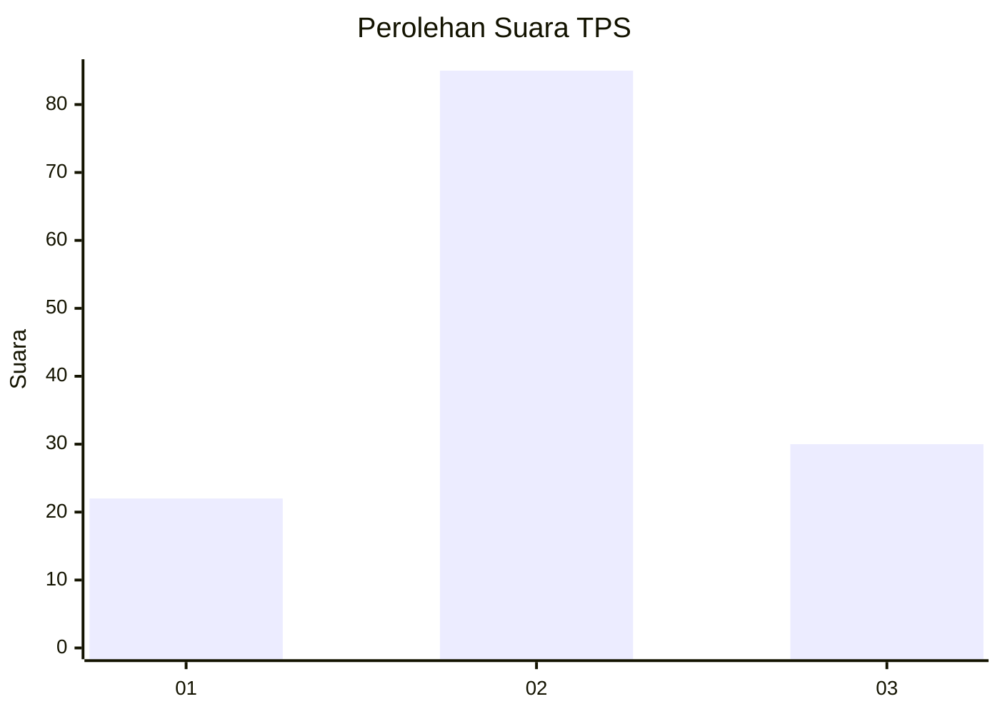
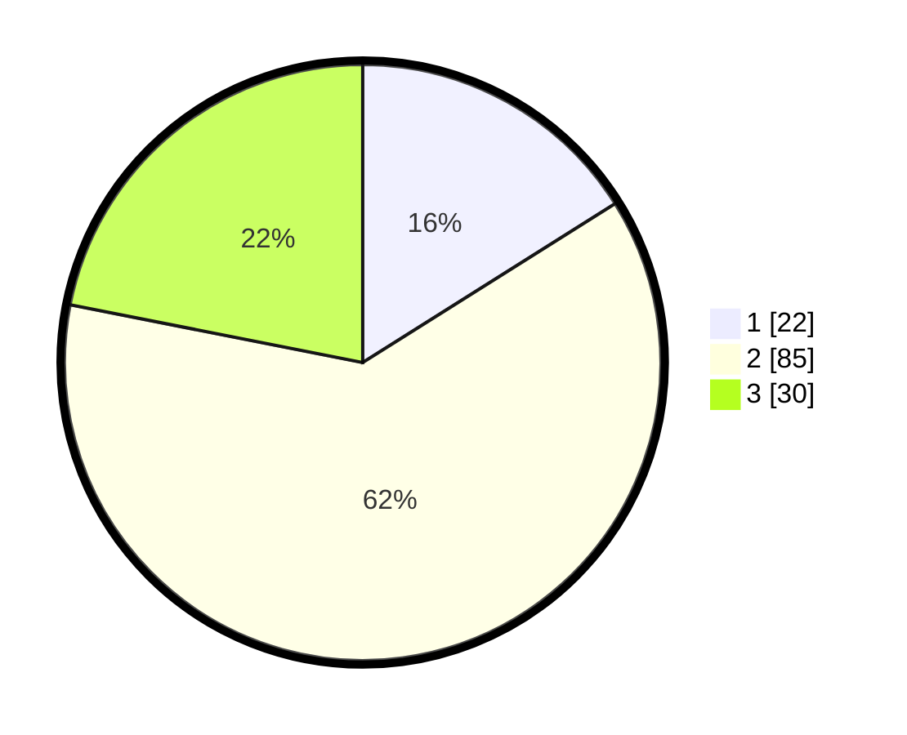

# Hasil

## Grafik

## Tabel

| No. | Nama Paslon    | Suara | Suara (raw) | Persentase |
|:--- |:-------------- | -----:| -----------:| ----------:|
| 1   | ANIES MUHAIMIN | 22    | [22][p-1]   | 16,06      |
| 2   | PRABOWO GIBRAN | 85    | [85][p-2]   | 62,04      |
| 3   | GANJAR MAHFUD  | 30    | [30][p-3]   | 21,90      |

[p-1]: https://github.com/gigit-pemilu/pemilu-2024-94-papua-tengah/blob/main/pilpres/hitung-suara/sub/94-papua-tengah/sub/04-mimika/sub/01-mimika-baru/sub/1014-timika-indah/sub/008-tps/sub/paslon-1.txt
[p-2]: https://github.com/gigit-pemilu/pemilu-2024-94-papua-tengah/blob/main/pilpres/hitung-suara/sub/94-papua-tengah/sub/04-mimika/sub/01-mimika-baru/sub/1014-timika-indah/sub/008-tps/sub/paslon-2.txt
[p-3]: https://github.com/gigit-pemilu/pemilu-2024-94-papua-tengah/blob/main/pilpres/hitung-suara/sub/94-papua-tengah/sub/04-mimika/sub/01-mimika-baru/sub/1014-timika-indah/sub/008-tps/sub/paslon-3.txt

## Foto C Plano

https://sirekap-obj-formc.kpu.go.id/a9c2/pemilu/ppwp/94/04/01/10/14/9404011014008-20240215-032540--18d0512a-74b5-4537-8693-8b46bf589418.jpg

https://sirekap-obj-formc.kpu.go.id/a9c2/pemilu/ppwp/94/04/01/10/14/9404011014008-20240215-032037--fb45b79c-003e-4117-b32a-71aad13fb847.jpg

https://sirekap-obj-formc.kpu.go.id/a9c2/pemilu/ppwp/94/04/01/10/14/9404011014008-20240215-032319--60edc2ed-0bd3-4880-b1f4-17947ad91bab.jpg

## Metadata

| Key        | Value               |
| ---------- | ------------------- |
| Time Stamp | 2024-02-25 02:00:00 |

