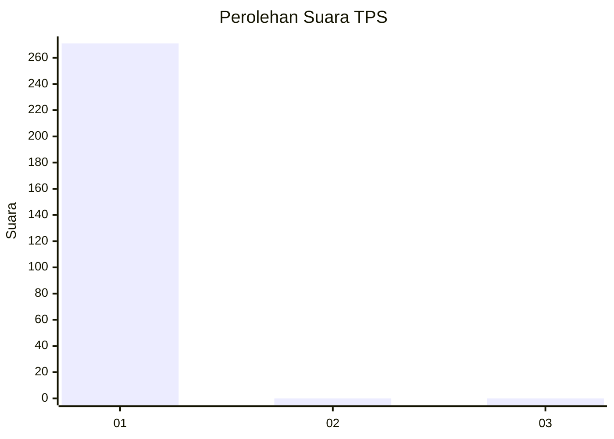
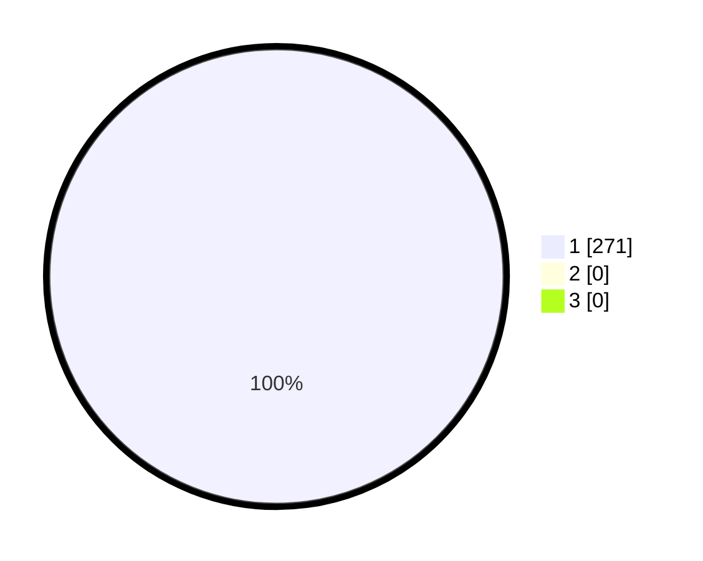

# Hasil

## Grafik

## Tabel

| No. | Nama Paslon    | Suara | Suara (raw) | Persentase |
|:--- |:-------------- | -----:| -----------:| ----------:|
| 1   | ANIES MUHAIMIN | 271   | [271][p-1]  | 100,00     |
| 2   | PRABOWO GIBRAN | 0     | [0][p-2]    | 0,00       |
| 3   | GANJAR MAHFUD  | 0     | [0][p-3]    | 0,00       |

[p-1]: https://github.com/gigit-pemilu/pemilu-2024-94-papua-tengah/blob/main/pilpres/hitung-suara/sub/94-papua-tengah/sub/04-mimika/sub/01-mimika-baru/sub/2005-minabua/sub/002-tps/sub/paslon-1.txt
[p-2]: https://github.com/gigit-pemilu/pemilu-2024-94-papua-tengah/blob/main/pilpres/hitung-suara/sub/94-papua-tengah/sub/04-mimika/sub/01-mimika-baru/sub/2005-minabua/sub/002-tps/sub/paslon-2.txt
[p-3]: https://github.com/gigit-pemilu/pemilu-2024-94-papua-tengah/blob/main/pilpres/hitung-suara/sub/94-papua-tengah/sub/04-mimika/sub/01-mimika-baru/sub/2005-minabua/sub/002-tps/sub/paslon-3.txt

## Foto C Plano

https://sirekap-obj-formc.kpu.go.id/cb7f/pemilu/ppwp/94/04/01/20/05/9404012005002-20240215-111640--ba407059-cb52-4e87-87ba-a572dd23dad9.jpg

https://sirekap-obj-formc.kpu.go.id/cb7f/pemilu/ppwp/94/04/01/20/05/9404012005002-20240215-111653--e9796593-9b8d-4758-93e7-b8c4ee3c691f.jpg

https://sirekap-obj-formc.kpu.go.id/cb7f/pemilu/ppwp/94/04/01/20/05/9404012005002-20240215-111720--582efb54-0a31-4aec-99b0-c1cc1c4ba035.jpg

## Metadata

| Key        | Value               |
| ---------- | ------------------- |
| Time Stamp | 2024-02-24 22:31:28 |

