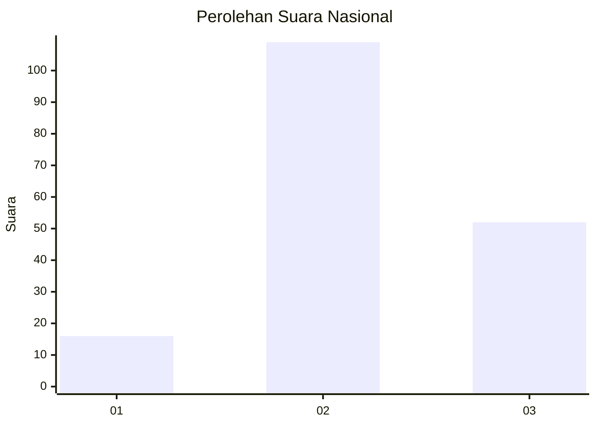
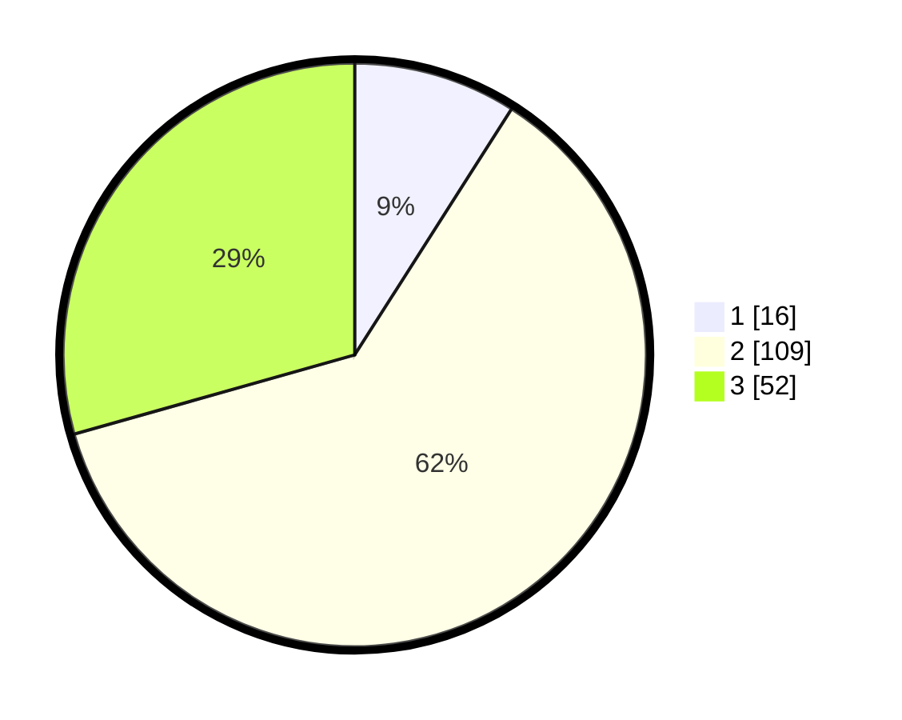

# Hasil

## Grafik

## Tabel

| No. | Nama Paslon    | Suara | Suara (raw) | Persentase |
|:--- |:-------------- | -----:| -----------:| ----------:|
| 1   | ANIES MUHAIMIN | 16    | [16][p-1]   | 9,04       |
| 2   | PRABOWO GIBRAN | 109   | [109][p-2]  | 61,58      |
| 3   | GANJAR MAHFUD  | 52    | [52][p-3]   | 29,38      |

[p-1]: https://github.com/gigit-pemilu/pemilu-2024/blob/main/pilpres/hitung-suara/sub/94-papua-tengah/sub/04-mimika/sub/03-mimika-timur/sub/2002-kaugapa/sub/003-tps/sub/paslon-1.txt
[p-2]: https://github.com/gigit-pemilu/pemilu-2024/blob/main/pilpres/hitung-suara/sub/94-papua-tengah/sub/04-mimika/sub/03-mimika-timur/sub/2002-kaugapa/sub/003-tps/sub/paslon-2.txt
[p-3]: https://github.com/gigit-pemilu/pemilu-2024/blob/main/pilpres/hitung-suara/sub/94-papua-tengah/sub/04-mimika/sub/03-mimika-timur/sub/2002-kaugapa/sub/003-tps/sub/paslon-3.txt

## Foto C Plano

https://sirekap-obj-formc.kpu.go.id/695a/pemilu/ppwp/94/04/03/20/02/9404032002003-20240215-063039--737d71c2-7ea5-4d1d-a045-b839a2bf351e.jpg

https://sirekap-obj-formc.kpu.go.id/695a/pemilu/ppwp/94/04/03/20/02/9404032002003-20240215-063113--c360e0c1-b91e-4154-929c-467fbe26ba0a.jpg

https://sirekap-obj-formc.kpu.go.id/695a/pemilu/ppwp/94/04/03/20/02/9404032002003-20240215-063148--0162e33b-f792-4bc8-a321-6f6f459de3fe.jpg

## Metadata

| Key        | Value               |
| ---------- | ------------------- |
| Time Stamp | 2024-02-15 21:01:18 |

