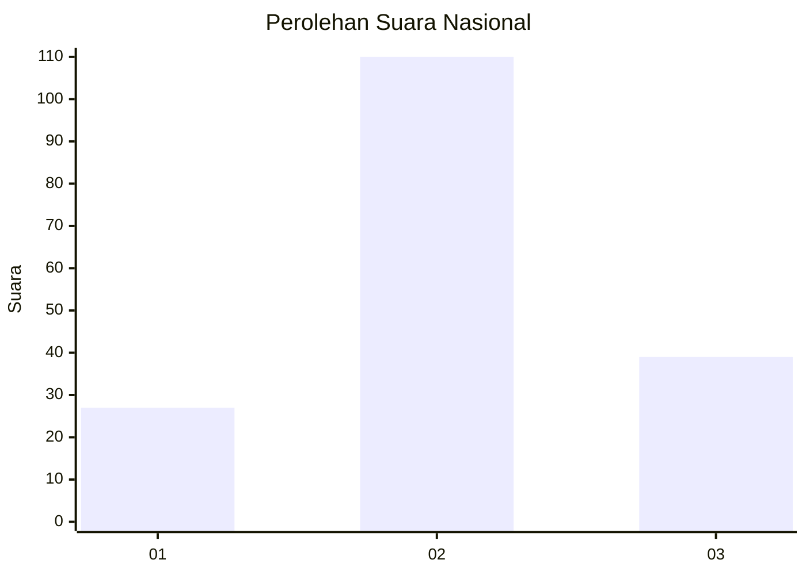
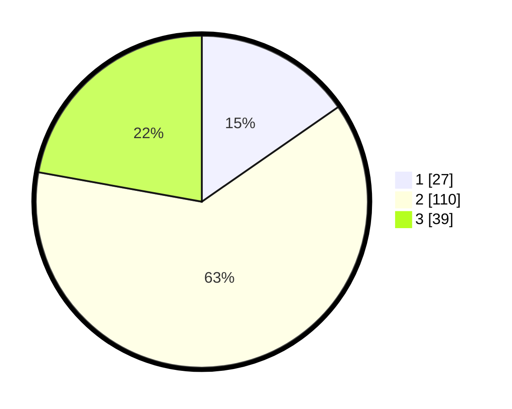

# Hasil

## Grafik

## Tabel

| No. | Nama Paslon    | Suara | Suara (raw) | Persentase |
|:--- |:-------------- | -----:| -----------:| ----------:|
| 1   | ANIES MUHAIMIN | 27    | [27][p-1]   | 15,34      |
| 2   | PRABOWO GIBRAN | 110   | [110][p-2]  | 62,50      |
| 3   | GANJAR MAHFUD  | 39    | [39][p-3]   | 22,16      |

[p-1]: https://github.com/gigit-pemilu/pemilu-2024/blob/main/pilpres/hitung-suara/sub/94-papua-tengah/sub/04-mimika/sub/03-mimika-timur/sub/2003-poumako/sub/010-tps/sub/paslon-1.txt
[p-2]: https://github.com/gigit-pemilu/pemilu-2024/blob/main/pilpres/hitung-suara/sub/94-papua-tengah/sub/04-mimika/sub/03-mimika-timur/sub/2003-poumako/sub/010-tps/sub/paslon-2.txt
[p-3]: https://github.com/gigit-pemilu/pemilu-2024/blob/main/pilpres/hitung-suara/sub/94-papua-tengah/sub/04-mimika/sub/03-mimika-timur/sub/2003-poumako/sub/010-tps/sub/paslon-3.txt

## Foto C Plano

https://sirekap-obj-formc.kpu.go.id/9651/pemilu/ppwp/94/04/03/20/03/9404032003010-20240215-045800--61c66304-6aa5-414a-9f2c-c324f7d5dd48.jpg

https://sirekap-obj-formc.kpu.go.id/9651/pemilu/ppwp/94/04/03/20/03/9404032003010-20240215-045911--b401d67f-a4f8-42ff-bcc6-527f6970eefc.jpg

https://sirekap-obj-formc.kpu.go.id/9651/pemilu/ppwp/94/04/03/20/03/9404032003010-20240215-050210--eac703d0-b1eb-44d2-9131-294ea3c90431.jpg

## Metadata

| Key        | Value               |
| ---------- | ------------------- |
| Time Stamp | 2024-02-15 21:30:27 |

