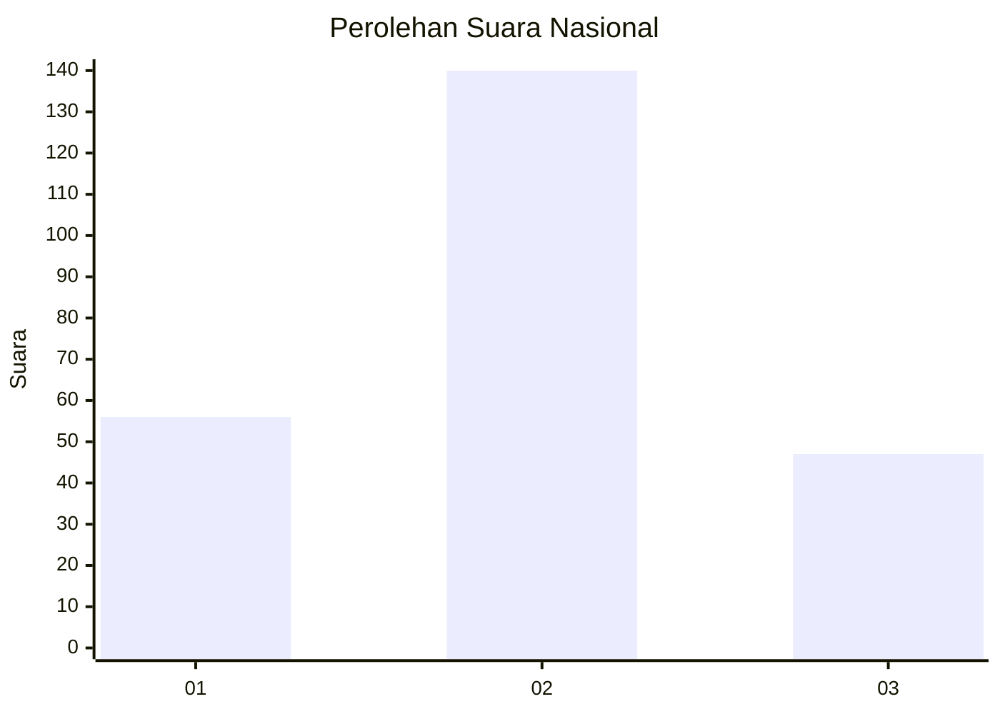
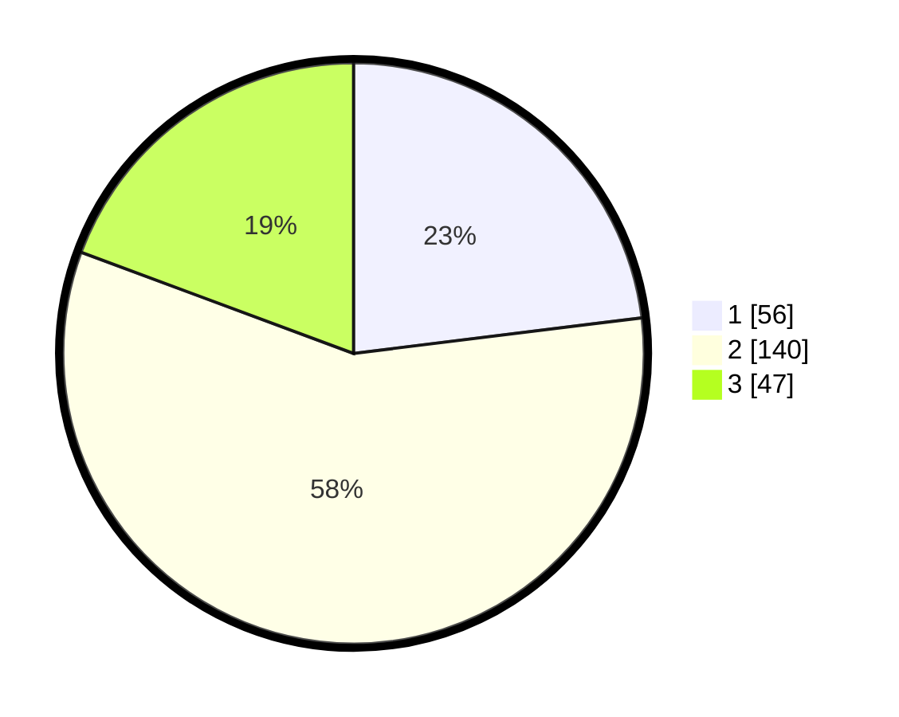

# Hasil

## Grafik

## Tabel

| No. | Nama Paslon    | Suara | Suara (raw) | Persentase |
|:--- |:-------------- | -----:| -----------:| ----------:|
| 1   | ANIES MUHAIMIN | 56    | [56][p-1]   | 23,05      |
| 2   | PRABOWO GIBRAN | 140   | [140][p-2]  | 57,61      |
| 3   | GANJAR MAHFUD  | 47    | [47][p-3]   | 19,34      |

[p-1]: https://github.com/gigit-pemilu/pemilu-2024/blob/main/pilpres/hitung-suara/sub/94-papua-tengah/sub/04-mimika/sub/09-kuala-kencana/sub/1001-kuala-kencana/sub/906-tps/sub/paslon-1.txt
[p-2]: https://github.com/gigit-pemilu/pemilu-2024/blob/main/pilpres/hitung-suara/sub/94-papua-tengah/sub/04-mimika/sub/09-kuala-kencana/sub/1001-kuala-kencana/sub/906-tps/sub/paslon-2.txt
[p-3]: https://github.com/gigit-pemilu/pemilu-2024/blob/main/pilpres/hitung-suara/sub/94-papua-tengah/sub/04-mimika/sub/09-kuala-kencana/sub/1001-kuala-kencana/sub/906-tps/sub/paslon-3.txt

## Foto C Plano

https://sirekap-obj-formc.kpu.go.id/1a31/pemilu/ppwp/94/04/09/10/01/9404091001906-20240214-213557--3e8df676-b33d-45e4-8baf-ccac3373abf4.jpg

https://sirekap-obj-formc.kpu.go.id/1a31/pemilu/ppwp/94/04/09/10/01/9404091001906-20240214-212229--e44b72d0-8cef-4c23-9bf8-3ec3cfde86b2.jpg

https://sirekap-obj-formc.kpu.go.id/1a31/pemilu/ppwp/94/04/09/10/01/9404091001906-20240214-212309--6d7da1c1-fef2-4030-8750-7e4dc5a57c9d.jpg

## Metadata

| Key        | Value               |
| ---------- | ------------------- |
| Time Stamp | 2024-02-25 14:00:00 |

