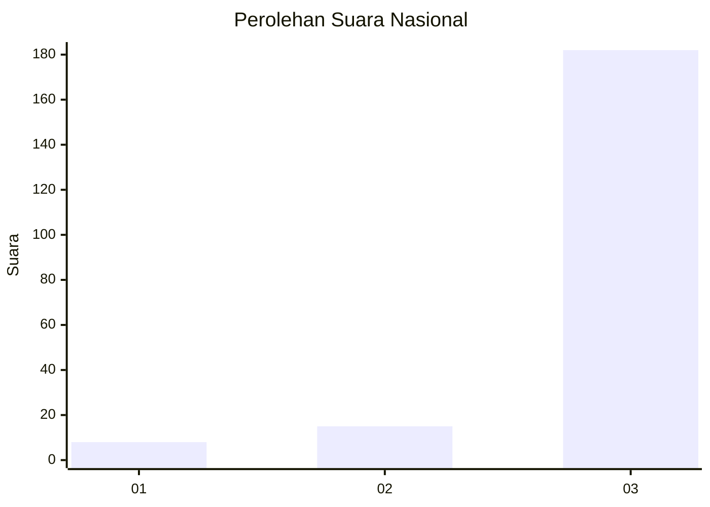
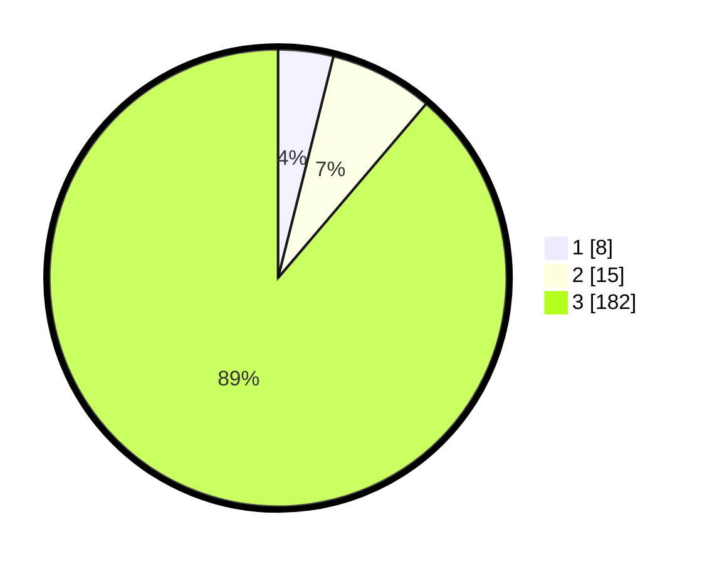

# Hasil

## Grafik

## Tabel

| No. | Nama Paslon    | Suara | Suara (raw) | Persentase |
|:--- |:-------------- | -----:| -----------:| ----------:|
| 1   | ANIES MUHAIMIN | 8     | [8][p-1]    | 3,90       |
| 2   | PRABOWO GIBRAN | 15    | [15][p-2]   | 7,32       |
| 3   | GANJAR MAHFUD  | 182   | [182][p-3]  | 88,78      |

[p-1]: https://github.com/gigit-pemilu/pemilu-2024/blob/main/pilpres/hitung-suara/sub/94-papua-tengah/sub/04-mimika/sub/11-mimika-barat-jauh/sub/2001-potowai-buru/sub/001-tps/sub/paslon-1.txt
[p-2]: https://github.com/gigit-pemilu/pemilu-2024/blob/main/pilpres/hitung-suara/sub/94-papua-tengah/sub/04-mimika/sub/11-mimika-barat-jauh/sub/2001-potowai-buru/sub/001-tps/sub/paslon-2.txt
[p-3]: https://github.com/gigit-pemilu/pemilu-2024/blob/main/pilpres/hitung-suara/sub/94-papua-tengah/sub/04-mimika/sub/11-mimika-barat-jauh/sub/2001-potowai-buru/sub/001-tps/sub/paslon-3.txt

## Foto C Plano

https://sirekap-obj-formc.kpu.go.id/14b5/pemilu/ppwp/94/04/11/20/01/9404112001001-20240222-083619--76be247e-b8de-47ec-811a-5355d0a4da55.jpg

https://sirekap-obj-formc.kpu.go.id/14b5/pemilu/ppwp/94/04/11/20/01/9404112001001-20240222-083712--436d0080-b051-4799-8e6e-57cd18ecf3e1.jpg

## Metadata

| Key        | Value               |
| ---------- | ------------------- |
| Time Stamp | 2024-02-25 13:00:00 |

