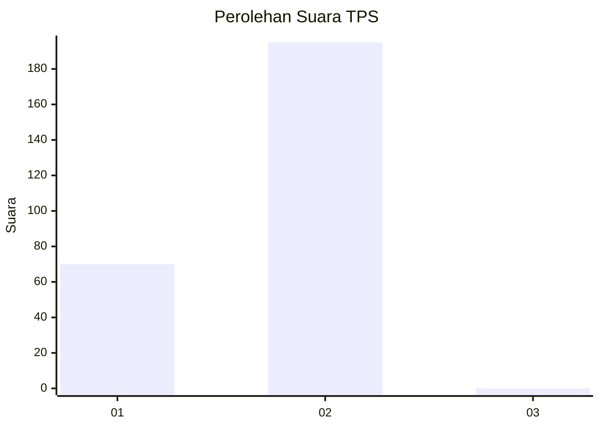
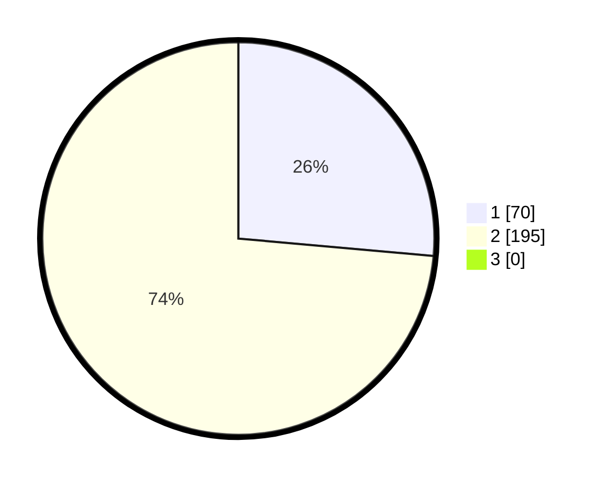

# Hasil

## Grafik

## Tabel

| No. | Nama Paslon    | Suara | Suara (raw) | Persentase |
|:--- |:-------------- | -----:| -----------:| ----------:|
| 1   | ANIES MUHAIMIN | 70    | [70][p-1]   | 26,42      |
| 2   | PRABOWO GIBRAN | 195   | [195][p-2]  | 73,58      |
| 3   | GANJAR MAHFUD  | 0     | [0][p-3]    | 0,00       |

[p-1]: https://github.com/gigit-pemilu/pemilu-2024-94-papua-tengah/blob/main/pilpres/hitung-suara/sub/94-papua-tengah/sub/04-mimika/sub/13-kwamki-narama/sub/1001-harapan/sub/003-tps/sub/paslon-1.txt
[p-2]: https://github.com/gigit-pemilu/pemilu-2024-94-papua-tengah/blob/main/pilpres/hitung-suara/sub/94-papua-tengah/sub/04-mimika/sub/13-kwamki-narama/sub/1001-harapan/sub/003-tps/sub/paslon-2.txt
[p-3]: https://github.com/gigit-pemilu/pemilu-2024-94-papua-tengah/blob/main/pilpres/hitung-suara/sub/94-papua-tengah/sub/04-mimika/sub/13-kwamki-narama/sub/1001-harapan/sub/003-tps/sub/paslon-3.txt

## Foto C Plano

https://sirekap-obj-formc.kpu.go.id/39dd/pemilu/ppwp/94/04/13/10/01/9404131001003-20240215-080955--2a1755ad-ca54-427b-b636-217b79edb1b5.jpg

https://sirekap-obj-formc.kpu.go.id/39dd/pemilu/ppwp/94/04/13/10/01/9404131001003-20240215-081207--0bdb064d-3bcb-47e4-b112-b70b25b677e1.jpg

https://sirekap-obj-formc.kpu.go.id/39dd/pemilu/ppwp/94/04/13/10/01/9404131001003-20240215-081337--400ddc82-2717-402e-8bb5-7ea1a586d5d7.jpg

## Metadata

| Key        | Value               |
| ---------- | ------------------- |
| Time Stamp | 2024-02-15 21:30:27 |

