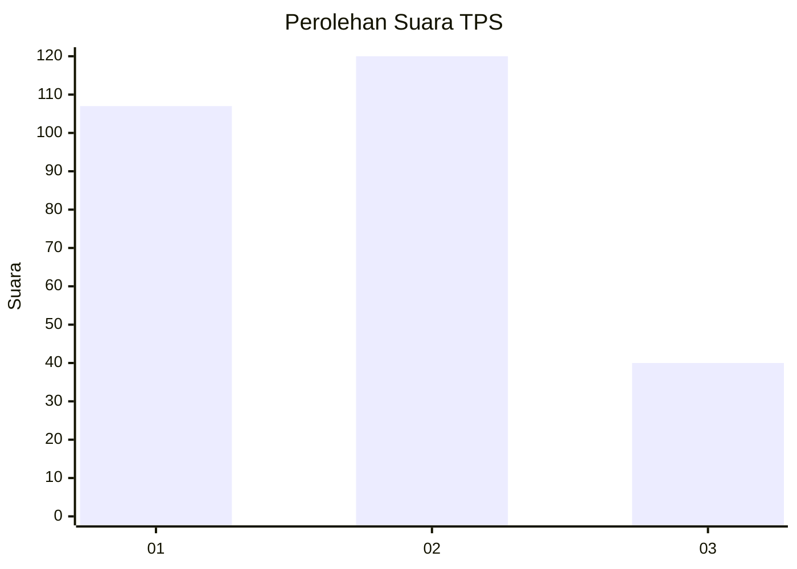
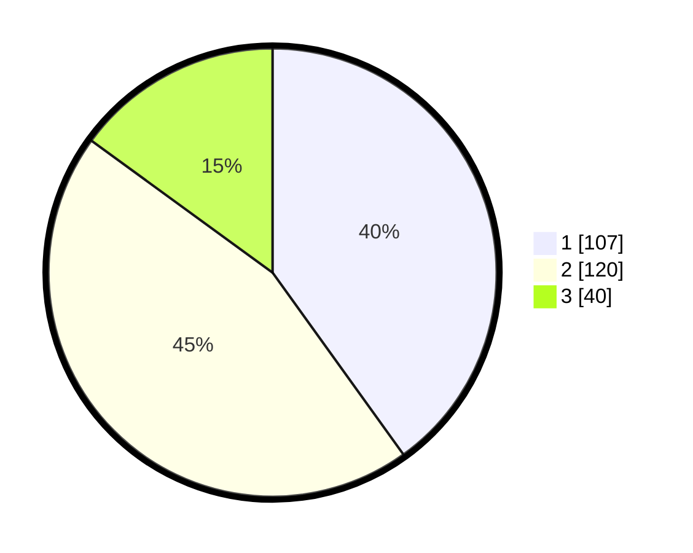

# Hasil

## Grafik

## Tabel

| No. | Nama Paslon    | Suara | Suara (raw) | Persentase |
|:--- |:-------------- | -----:| -----------:| ----------:|
| 1   | ANIES MUHAIMIN | 107   | [107][p-1]  | 40,07      |
| 2   | PRABOWO GIBRAN | 120   | [120][p-2]  | 44,94      |
| 3   | GANJAR MAHFUD  | 40    | [40][p-3]   | 14,98      |

[p-1]: https://github.com/gigit-pemilu/pemilu-2024-94-papua-tengah/blob/main/pilpres/hitung-suara/sub/94-papua-tengah/sub/04-mimika/sub/13-kwamki-narama/sub/1001-harapan/sub/012-tps/sub/paslon-1.txt
[p-2]: https://github.com/gigit-pemilu/pemilu-2024-94-papua-tengah/blob/main/pilpres/hitung-suara/sub/94-papua-tengah/sub/04-mimika/sub/13-kwamki-narama/sub/1001-harapan/sub/012-tps/sub/paslon-2.txt
[p-3]: https://github.com/gigit-pemilu/pemilu-2024-94-papua-tengah/blob/main/pilpres/hitung-suara/sub/94-papua-tengah/sub/04-mimika/sub/13-kwamki-narama/sub/1001-harapan/sub/012-tps/sub/paslon-3.txt

## Foto C Plano

https://sirekap-obj-formc.kpu.go.id/555e/pemilu/ppwp/94/04/13/10/01/9404131001012-20240215-002144--26b6e3c2-cebc-4947-986e-696cf4973f93.jpg

https://sirekap-obj-formc.kpu.go.id/555e/pemilu/ppwp/94/04/13/10/01/9404131001012-20240215-041829--3cf34478-6593-4d31-9521-93b0b7dbe8f8.jpg

## Metadata

| Key        | Value               |
| ---------- | ------------------- |
| Time Stamp | 2024-02-15 21:30:27 |

