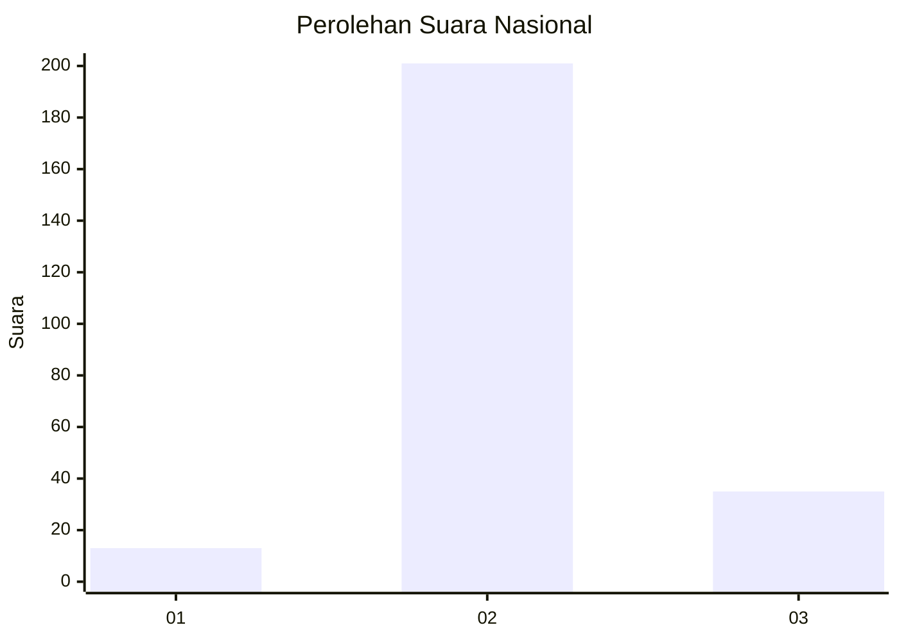
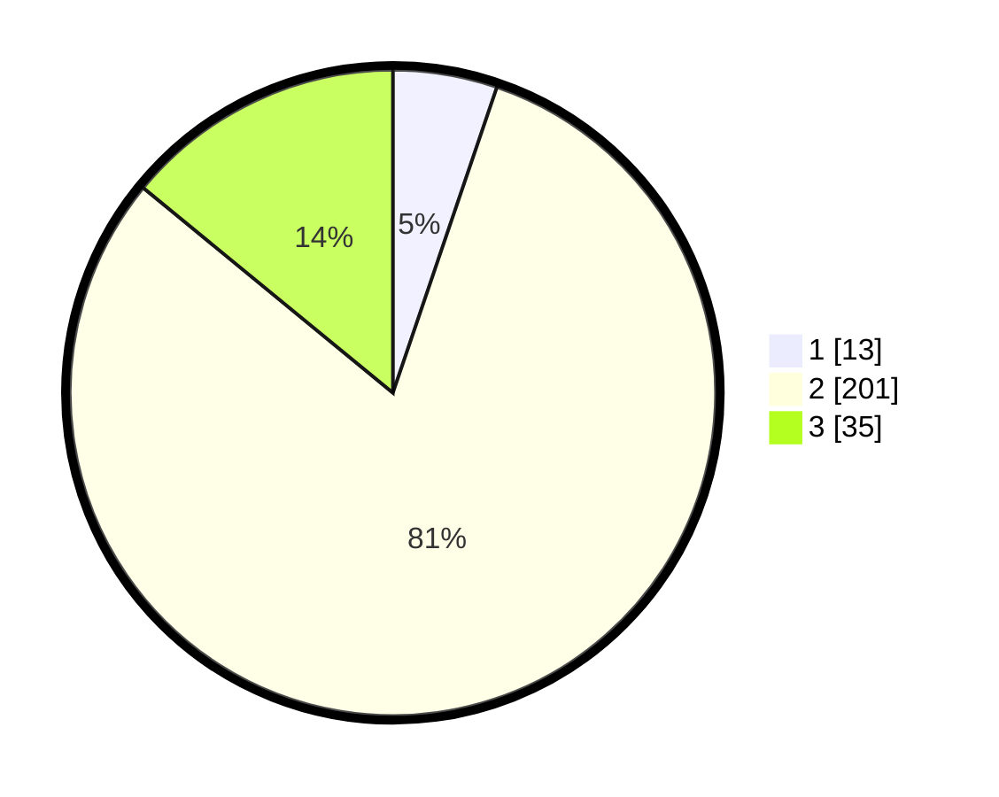

# Hasil

## Grafik

## Tabel

| No. | Nama Paslon    | Suara | Suara (raw) | Persentase |
|:--- |:-------------- | -----:| -----------:| ----------:|
| 1   | ANIES MUHAIMIN | 13    | [13][p-1]   | 5,22       |
| 2   | PRABOWO GIBRAN | 201   | [201][p-2]  | 80,72      |
| 3   | GANJAR MAHFUD  | 35    | [35][p-3]   | 14,06      |

[p-1]: https://github.com/gigit-pemilu/pemilu-2024/blob/main/pilpres/hitung-suara/sub/94-papua-tengah/sub/04-mimika/sub/15-iwaka/sub/2004-naena-muktipura/sub/005-tps/sub/paslon-1.txt
[p-2]: https://github.com/gigit-pemilu/pemilu-2024/blob/main/pilpres/hitung-suara/sub/94-papua-tengah/sub/04-mimika/sub/15-iwaka/sub/2004-naena-muktipura/sub/005-tps/sub/paslon-2.txt
[p-3]: https://github.com/gigit-pemilu/pemilu-2024/blob/main/pilpres/hitung-suara/sub/94-papua-tengah/sub/04-mimika/sub/15-iwaka/sub/2004-naena-muktipura/sub/005-tps/sub/paslon-3.txt

## Foto C Plano

https://sirekap-obj-formc.kpu.go.id/72df/pemilu/ppwp/94/04/15/20/04/9404152004005-20240215-115821--5fd114d9-7eda-42b5-835f-2be66223af85.jpg

https://sirekap-obj-formc.kpu.go.id/72df/pemilu/ppwp/94/04/15/20/04/9404152004005-20240215-115947--5de6fb1e-39e5-4027-968d-79ddfe541c91.jpg

https://sirekap-obj-formc.kpu.go.id/72df/pemilu/ppwp/94/04/15/20/04/9404152004005-20240215-120105--4b177652-39e3-46c2-8dd1-8a4a92430697.jpg

## Metadata

| Key        | Value               |
| ---------- | ------------------- |
| Time Stamp | 2024-02-15 21:30:27 |

