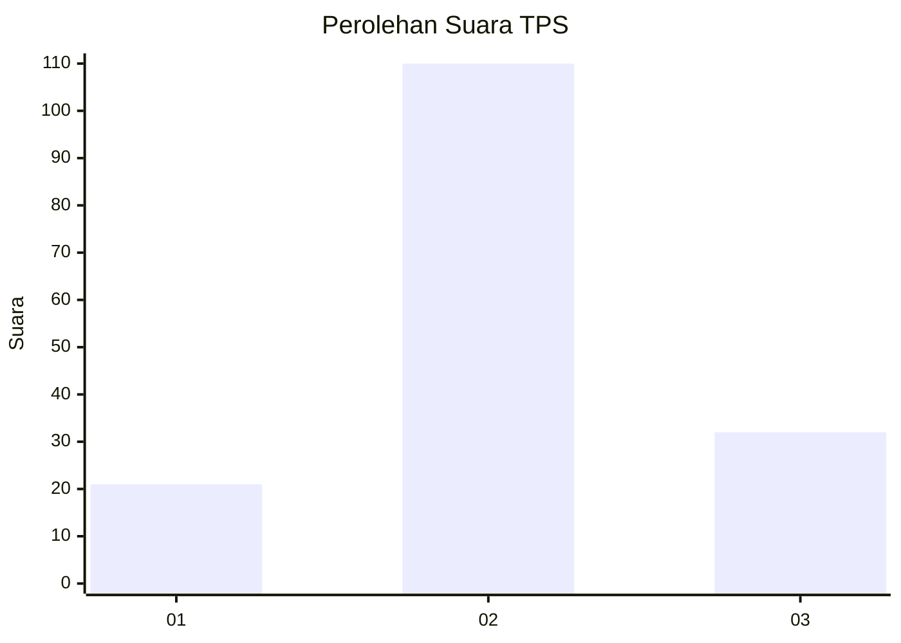
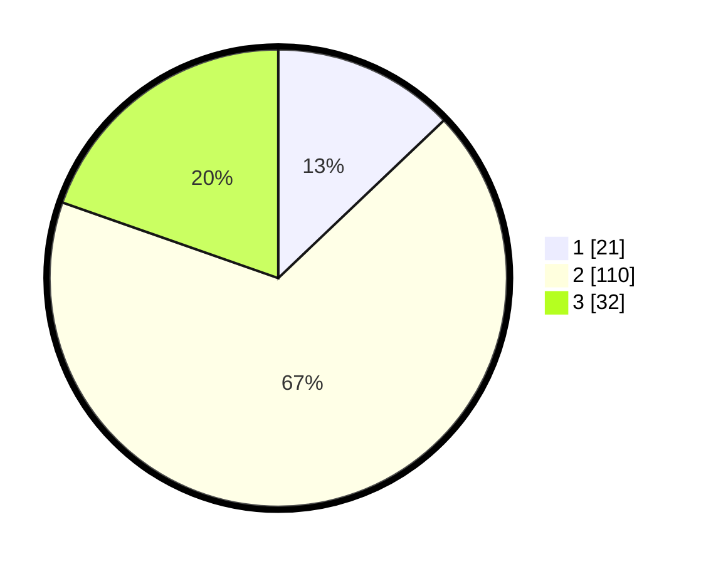

# Hasil

## Grafik

## Tabel

| No. | Nama Paslon    | Suara | Suara (raw) | Persentase |
|:--- |:-------------- | -----:| -----------:| ----------:|
| 1   | ANIES MUHAIMIN | 21    | [21][p-1]   | 12,88      |
| 2   | PRABOWO GIBRAN | 110   | [110][p-2]  | 67,48      |
| 3   | GANJAR MAHFUD  | 32    | [32][p-3]   | 19,63      |

[p-1]: https://github.com/gigit-pemilu/pemilu-2024-94-papua-tengah/blob/main/pilpres/hitung-suara/sub/94-papua-tengah/sub/04-mimika/sub/15-iwaka/sub/2007-limau-asri-barat/sub/901-tps/sub/paslon-1.txt
[p-2]: https://github.com/gigit-pemilu/pemilu-2024-94-papua-tengah/blob/main/pilpres/hitung-suara/sub/94-papua-tengah/sub/04-mimika/sub/15-iwaka/sub/2007-limau-asri-barat/sub/901-tps/sub/paslon-2.txt
[p-3]: https://github.com/gigit-pemilu/pemilu-2024-94-papua-tengah/blob/main/pilpres/hitung-suara/sub/94-papua-tengah/sub/04-mimika/sub/15-iwaka/sub/2007-limau-asri-barat/sub/901-tps/sub/paslon-3.txt

## Foto C Plano

https://sirekap-obj-formc.kpu.go.id/bc42/pemilu/ppwp/94/04/15/20/07/9404152007901-20240215-220515--1f1079ca-cc7c-4969-9176-bb500b1891b3.jpg

https://sirekap-obj-formc.kpu.go.id/bc42/pemilu/ppwp/94/04/15/20/07/9404152007901-20240214-200118--90b16496-e7aa-4ad4-9bbd-49299b04bb55.jpg

https://sirekap-obj-formc.kpu.go.id/bc42/pemilu/ppwp/94/04/15/20/07/9404152007901-20240214-200145--e5d85a60-6dc7-47c5-9e87-9acf6cccdcee.jpg

## Metadata

| Key        | Value               |
| ---------- | ------------------- |
| Time Stamp | 2024-02-15 22:30:27 |

## DATA PEMILIH TETAP

Jumlah pemilih dalam DPT: **164**.
 * L: **143**.
 * P: **21**.

## DATA PENGGUNA HAK PILIH

Jumlah pengguna hak pilih dalam DPT: **164**.
 * L: **143**.
 * P: **21**.

Jumlah pengguna hak pilih dalam DPTb: **0**.
 * L: **0**.
 * P: **0**.

Jumlah pengguna hak pilih dalam DPK: **0**.
 * L: **0**.
 * P: **0**.

Jumlah pengguna hak pilih: **164**.
 * L: **143**.
 * P: **21**.

## JUMLAH SUARA SAH DAN TIDAK SAH

JUMLAH SELURUH SUARA SAH: **163**.

JUMLAH SUARA TIDAK SAH: **1**.

JUMLAH SELURUH SUARA SAH DAN SUARA TIDAK SAH: **164**.

