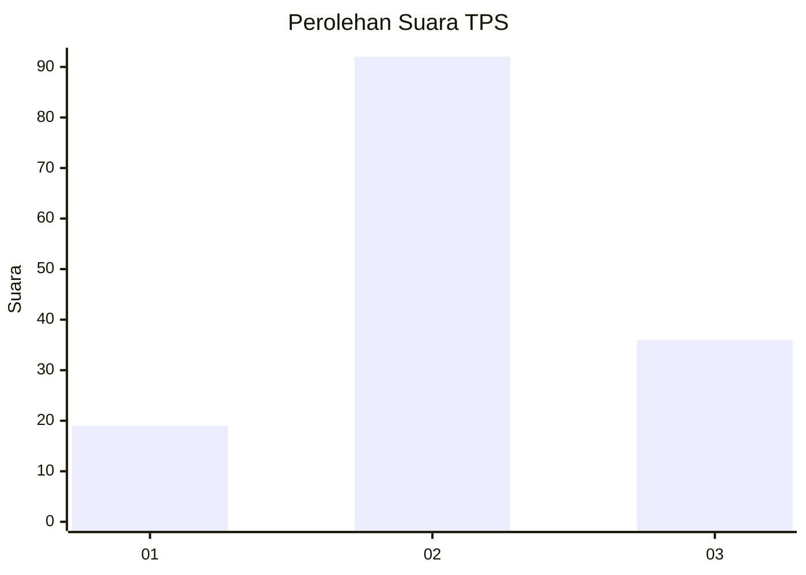
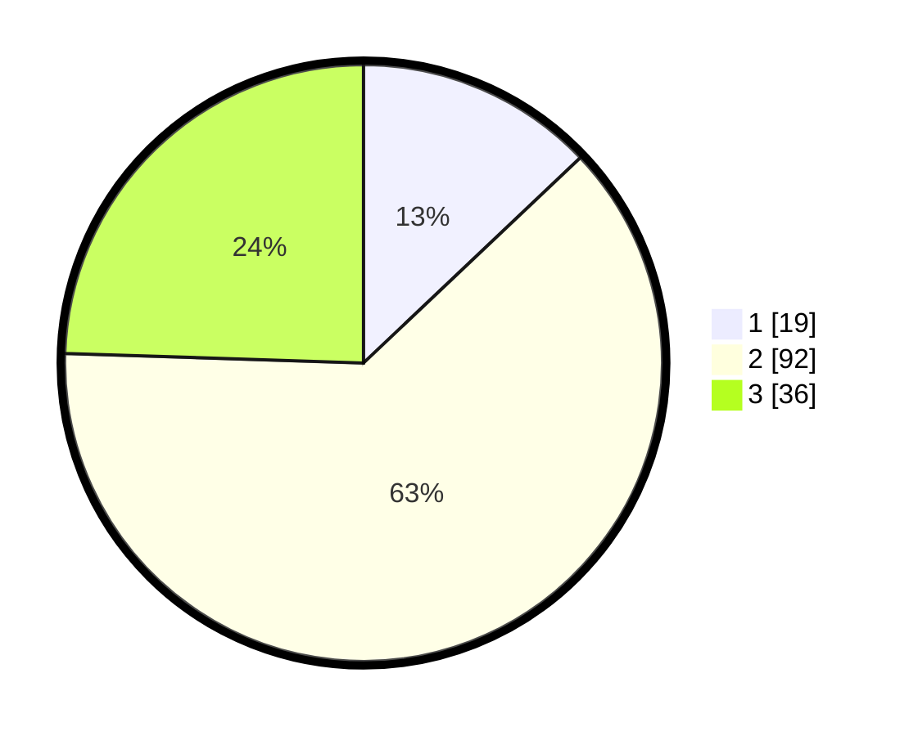

# Hasil

## Grafik

## Tabel

| No. | Nama Paslon    | Suara | Suara (raw) | Persentase |
|:--- |:-------------- | -----:| -----------:| ----------:|
| 1   | ANIES MUHAIMIN | 19    | [19][p-1]   | 12,93      |
| 2   | PRABOWO GIBRAN | 92    | [92][p-2]   | 62,59      |
| 3   | GANJAR MAHFUD  | 36    | [36][p-3]   | 24,49      |

[p-1]: https://github.com/gigit-pemilu/pemilu-2024-94-papua-tengah/blob/main/pilpres/hitung-suara/sub/94-papua-tengah/sub/04-mimika/sub/15-iwaka/sub/2007-limau-asri-barat/sub/902-tps/sub/paslon-1.txt
[p-2]: https://github.com/gigit-pemilu/pemilu-2024-94-papua-tengah/blob/main/pilpres/hitung-suara/sub/94-papua-tengah/sub/04-mimika/sub/15-iwaka/sub/2007-limau-asri-barat/sub/902-tps/sub/paslon-2.txt
[p-3]: https://github.com/gigit-pemilu/pemilu-2024-94-papua-tengah/blob/main/pilpres/hitung-suara/sub/94-papua-tengah/sub/04-mimika/sub/15-iwaka/sub/2007-limau-asri-barat/sub/902-tps/sub/paslon-3.txt

## Foto C Plano

https://sirekap-obj-formc.kpu.go.id/4319/pemilu/ppwp/94/04/15/20/07/9404152007902-20240214-215043--1c455114-55c7-411c-b345-f4cd57f7ad02.jpg

https://sirekap-obj-formc.kpu.go.id/4319/pemilu/ppwp/94/04/15/20/07/9404152007902-20240214-215255--95b81535-2614-43e4-aaea-52838dcafd18.jpg

https://sirekap-obj-formc.kpu.go.id/4319/pemilu/ppwp/94/04/15/20/07/9404152007902-20240214-215326--a7309e51-79c4-48f0-a31a-4448f7e3f766.jpg

## Metadata

| Key        | Value               |
| ---------- | ------------------- |
| Time Stamp | 2024-02-15 20:00:44 |

## DATA PEMILIH TETAP

Jumlah pemilih dalam DPT: **146**.
 * L: **140**.
 * P: **6**.

## DATA PENGGUNA HAK PILIH

Jumlah pengguna hak pilih dalam DPT: **146**.
 * L: **140**.
 * P: **6**.

Jumlah pengguna hak pilih dalam DPTb: **12**.
 * L: **8**.
 * P: **4**.

Jumlah pengguna hak pilih dalam DPK: **0**.
 * L: **0**.
 * P: **0**.

Jumlah pengguna hak pilih: **158**.
 * L: **148**.
 * P: **10**.

## JUMLAH SUARA SAH DAN TIDAK SAH

JUMLAH SELURUH SUARA SAH: **147**.

JUMLAH SUARA TIDAK SAH: **11**.

JUMLAH SELURUH SUARA SAH DAN SUARA TIDAK SAH: **158**.

