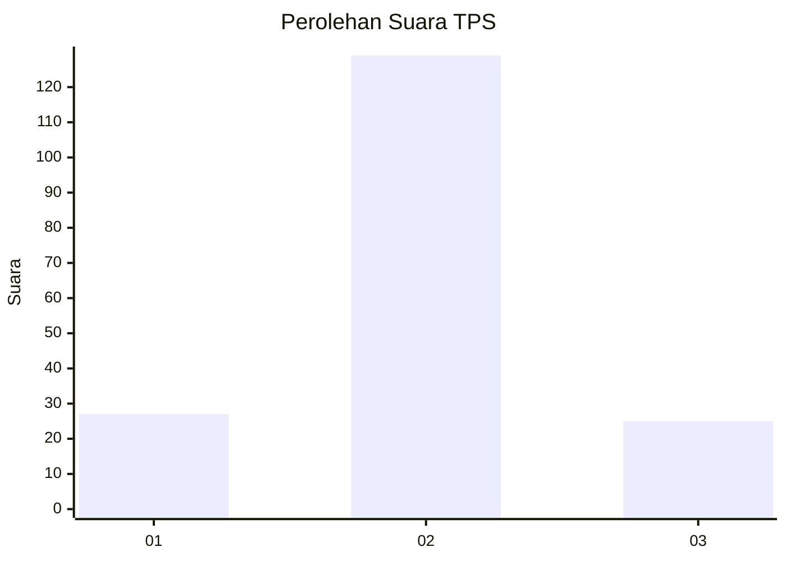

# Hasil

## Grafik

## Tabel

| No. | Nama Paslon    | Suara | Suara (raw) | Persentase |
|:--- |:-------------- | -----:| -----------:| ----------:|
| 1   | ANIES MUHAIMIN | 27    | [27][p-1]   | 14,92      |
| 2   | PRABOWO GIBRAN | 129   | [129][p-2]  | 71,27      |
| 3   | GANJAR MAHFUD  | 25    | [25][p-3]   | 13,81      |

[p-1]: https://github.com/gigit-pemilu/pemilu-2024-94-papua-tengah/blob/main/pilpres/hitung-suara/sub/94-papua-tengah/sub/04-mimika/sub/16-wania/sub/1003-wonosari-jaya/sub/005-tps/sub/paslon-1.txt
[p-2]: https://github.com/gigit-pemilu/pemilu-2024-94-papua-tengah/blob/main/pilpres/hitung-suara/sub/94-papua-tengah/sub/04-mimika/sub/16-wania/sub/1003-wonosari-jaya/sub/005-tps/sub/paslon-2.txt
[p-3]: https://github.com/gigit-pemilu/pemilu-2024-94-papua-tengah/blob/main/pilpres/hitung-suara/sub/94-papua-tengah/sub/04-mimika/sub/16-wania/sub/1003-wonosari-jaya/sub/005-tps/sub/paslon-3.txt

## Foto C Plano

https://sirekap-obj-formc.kpu.go.id/3c22/pemilu/ppwp/94/04/16/10/03/9404161003005-20240214-184516--327b2872-ec2d-4c97-98a2-9385c1dafadd.jpg

https://sirekap-obj-formc.kpu.go.id/3c22/pemilu/ppwp/94/04/16/10/03/9404161003005-20240214-191752--1a51207e-964f-4858-83b9-aa5262d7e9da.jpg

https://sirekap-obj-formc.kpu.go.id/3c22/pemilu/ppwp/94/04/16/10/03/9404161003005-20240214-191335--cd185dec-d872-4e59-8b2d-bd9e0df7c72c.jpg

## Metadata

| Key        | Value               |
| ---------- | ------------------- |
| Time Stamp | 2024-02-14 21:46:01 |

## DATA PEMILIH TETAP

Jumlah pemilih dalam DPT: **275**.
 * L: **143**.
 * P: **132**.

## DATA PENGGUNA HAK PILIH

Jumlah pengguna hak pilih dalam DPT: **166**.
 * L: **84**.
 * P: **82**.

Jumlah pengguna hak pilih dalam DPTb: **28**.
 * L: **19**.
 * P: **9**.

Jumlah pengguna hak pilih dalam DPK: **0**.
 * L: **0**.
 * P: **0**.

Jumlah pengguna hak pilih: **194**.
 * L: **103**.
 * P: **91**.

## JUMLAH SUARA SAH DAN TIDAK SAH

JUMLAH SELURUH SUARA SAH: **191**.

JUMLAH SUARA TIDAK SAH: **3**.

JUMLAH SELURUH SUARA SAH DAN SUARA TIDAK SAH: **194**.

