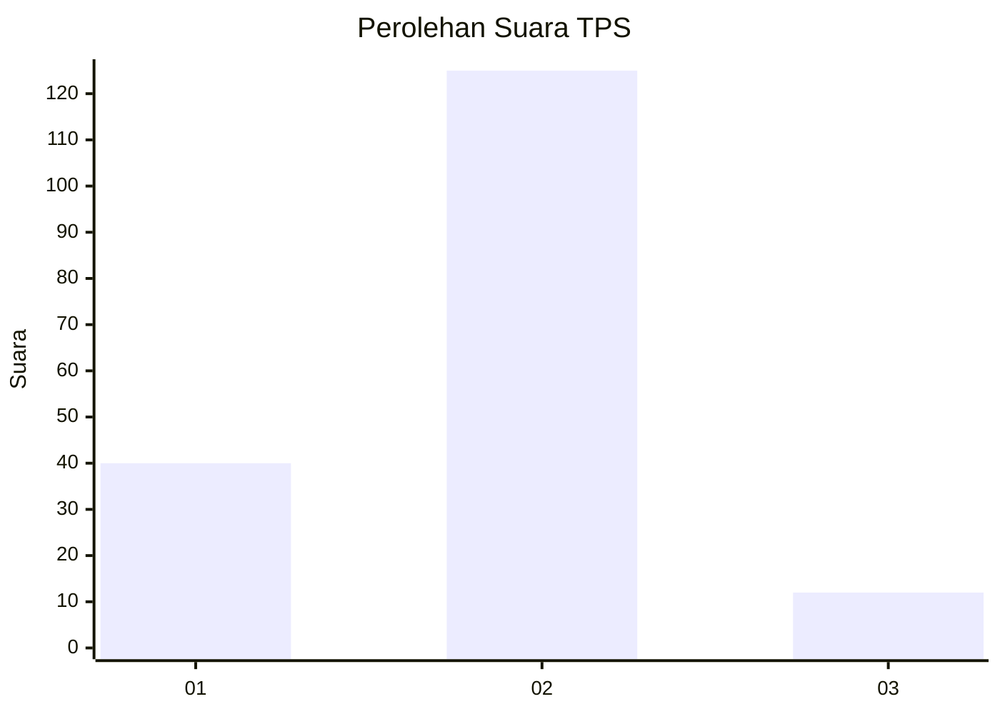

# Hasil

## Grafik

## Tabel

| No. | Nama Paslon    | Suara | Suara (raw) | Persentase |
|:--- |:-------------- | -----:| -----------:| ----------:|
| 1   | ANIES MUHAIMIN | 40    | [40][p-1]   | 22,60      |
| 2   | PRABOWO GIBRAN | 125   | [125][p-2]  | 70,62      |
| 3   | GANJAR MAHFUD  | 12    | [12][p-3]   | 6,78       |

[p-1]: https://github.com/gigit-pemilu/pemilu-2024-94-papua-tengah/blob/main/pilpres/hitung-suara/sub/94-papua-tengah/sub/04-mimika/sub/16-wania/sub/1003-wonosari-jaya/sub/007-tps/sub/paslon-1.txt
[p-2]: https://github.com/gigit-pemilu/pemilu-2024-94-papua-tengah/blob/main/pilpres/hitung-suara/sub/94-papua-tengah/sub/04-mimika/sub/16-wania/sub/1003-wonosari-jaya/sub/007-tps/sub/paslon-2.txt
[p-3]: https://github.com/gigit-pemilu/pemilu-2024-94-papua-tengah/blob/main/pilpres/hitung-suara/sub/94-papua-tengah/sub/04-mimika/sub/16-wania/sub/1003-wonosari-jaya/sub/007-tps/sub/paslon-3.txt

## Foto C Plano

https://sirekap-obj-formc.kpu.go.id/869b/pemilu/ppwp/94/04/16/10/03/9404161003007-20240214-160100--e5d6efbe-6e37-4ca1-aee5-2d37ea0a599a.jpg

https://sirekap-obj-formc.kpu.go.id/869b/pemilu/ppwp/94/04/16/10/03/9404161003007-20240214-162242--8b9385ba-c4be-418a-82e3-4553b32799b3.jpg

https://sirekap-obj-formc.kpu.go.id/869b/pemilu/ppwp/94/04/16/10/03/9404161003007-20240215-032355--e6c45d18-522d-486c-8d40-6ea49e5d40f1.jpg

## Metadata

| Key        | Value               |
| ---------- | ------------------- |
| Time Stamp | 2024-02-15 05:00:24 |

## DATA PEMILIH TETAP

Jumlah pemilih dalam DPT: **260**.
 * L: **130**.
 * P: **130**.

## DATA PENGGUNA HAK PILIH

Jumlah pengguna hak pilih dalam DPT: **180**.
 * L: **96**.
 * P: **84**.

Jumlah pengguna hak pilih dalam DPTb: **0**.
 * L: **0**.
 * P: **0**.

Jumlah pengguna hak pilih dalam DPK: **5**.
 * L: **2**.
 * P: **3**.

Jumlah pengguna hak pilih: **180**.
 * L: **96**.
 * P: **84**.

## JUMLAH SUARA SAH DAN TIDAK SAH

JUMLAH SELURUH SUARA SAH: **177**.

JUMLAH SUARA TIDAK SAH: **3**.

JUMLAH SELURUH SUARA SAH DAN SUARA TIDAK SAH: **180**.

