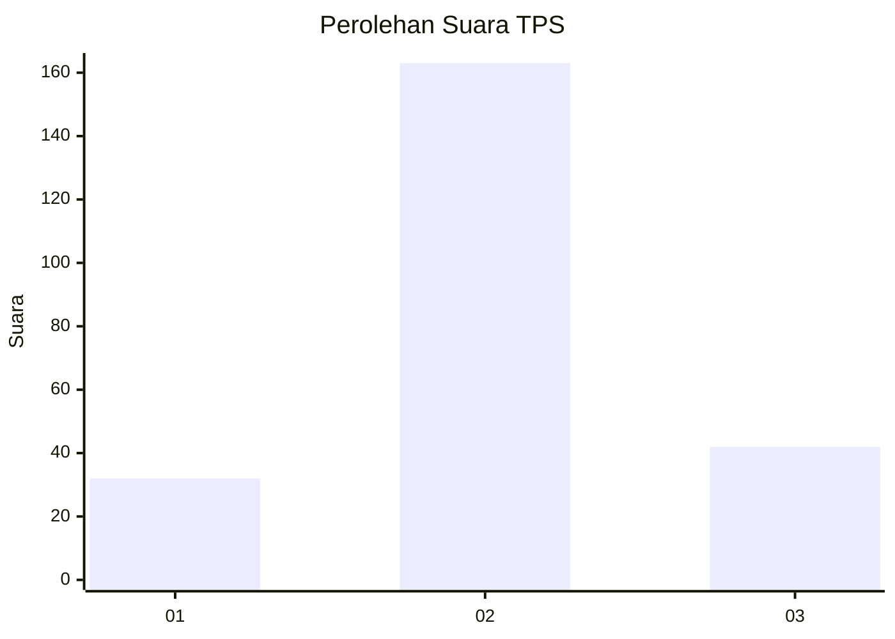
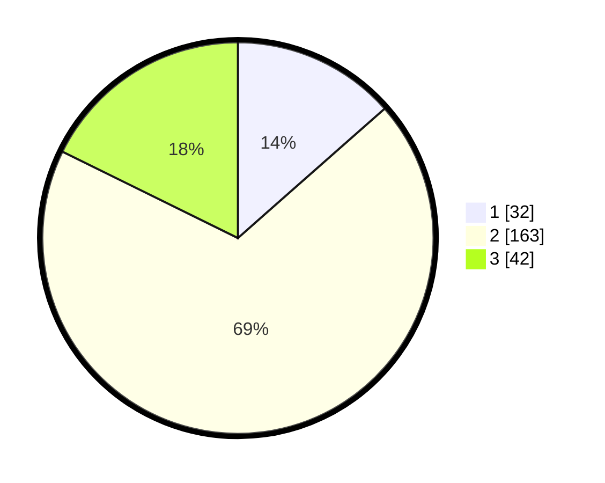

# Hasil

## Grafik

## Tabel

| No. | Nama Paslon    | Suara | Suara (raw) | Persentase |
|:--- |:-------------- | -----:| -----------:| ----------:|
| 1   | ANIES MUHAIMIN | 32    | [32][p-1]   | 13,50      |
| 2   | PRABOWO GIBRAN | 163   | [163][p-2]  | 68,78      |
| 3   | GANJAR MAHFUD  | 42    | [42][p-3]   | 17,72      |

[p-1]: https://github.com/gigit-pemilu/pemilu-2024-94-papua-tengah/blob/main/pilpres/hitung-suara/sub/94-papua-tengah/sub/04-mimika/sub/16-wania/sub/1003-wonosari-jaya/sub/018-tps/sub/paslon-1.txt
[p-2]: https://github.com/gigit-pemilu/pemilu-2024-94-papua-tengah/blob/main/pilpres/hitung-suara/sub/94-papua-tengah/sub/04-mimika/sub/16-wania/sub/1003-wonosari-jaya/sub/018-tps/sub/paslon-2.txt
[p-3]: https://github.com/gigit-pemilu/pemilu-2024-94-papua-tengah/blob/main/pilpres/hitung-suara/sub/94-papua-tengah/sub/04-mimika/sub/16-wania/sub/1003-wonosari-jaya/sub/018-tps/sub/paslon-3.txt

## Foto C Plano

https://sirekap-obj-formc.kpu.go.id/be05/pemilu/ppwp/94/04/16/10/03/9404161003018-20240214-220201--32bf9414-599c-471e-90c3-5c1f0402eea5.jpg

https://sirekap-obj-formc.kpu.go.id/be05/pemilu/ppwp/94/04/16/10/03/9404161003018-20240214-220311--f9d27ebc-4fc0-47aa-afcf-5055ec980d57.jpg

https://sirekap-obj-formc.kpu.go.id/be05/pemilu/ppwp/94/04/16/10/03/9404161003018-20240214-220701--247bed82-6c99-4f74-ae58-6f9ffaa4b6ae.jpg

## Metadata

| Key        | Value               |
| ---------- | ------------------- |
| Time Stamp | 2024-02-15 20:30:46 |

