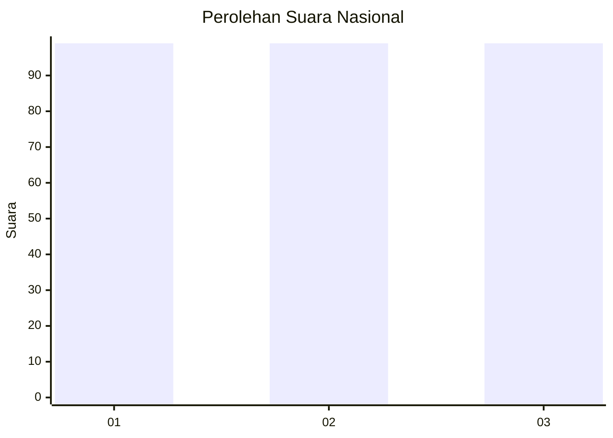
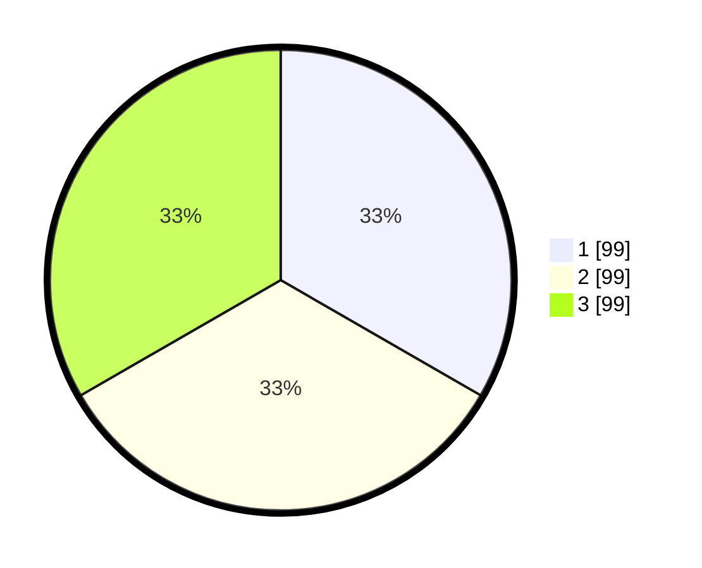

# Hasil

## Grafik

## Tabel

| No. | Nama Paslon    | Suara | Suara (raw) | Persentase |
|:--- |:-------------- | -----:| -----------:| ----------:|
| 1   | ANIES MUHAIMIN | 99    | [99][p-1]   | 33,33      |
| 2   | PRABOWO GIBRAN | 99    | [99][p-2]   | 33,33      |
| 3   | GANJAR MAHFUD  | 99    | [99][p-3]   | 33,33      |

[p-1]: https://github.com/gigit-pemilu/pemilu-2024/blob/main/pilpres/hitung-suara/sub/94-papua-tengah/sub/06-dogiyai/sub/10-dogiyai/sub/2002-kigamani/sub/004-tps/sub/paslon-1.txt
[p-2]: https://github.com/gigit-pemilu/pemilu-2024/blob/main/pilpres/hitung-suara/sub/94-papua-tengah/sub/06-dogiyai/sub/10-dogiyai/sub/2002-kigamani/sub/004-tps/sub/paslon-2.txt
[p-3]: https://github.com/gigit-pemilu/pemilu-2024/blob/main/pilpres/hitung-suara/sub/94-papua-tengah/sub/06-dogiyai/sub/10-dogiyai/sub/2002-kigamani/sub/004-tps/sub/paslon-3.txt

## Foto C Plano

https://sirekap-obj-formc.kpu.go.id/4fcb/pemilu/ppwp/94/06/10/20/02/9406102002004-20240215-132758--b0a42da1-44e0-4be6-ad47-fc08e658e8b3.jpg

https://sirekap-obj-formc.kpu.go.id/4fcb/pemilu/ppwp/94/06/10/20/02/9406102002004-20240215-133030--26992fae-3b1a-4e15-ac59-dee1d9ffecf0.jpg

## Metadata

| Key        | Value               |
| ---------- | ------------------- |
| Time Stamp | 2024-02-25 18:00:00 |

