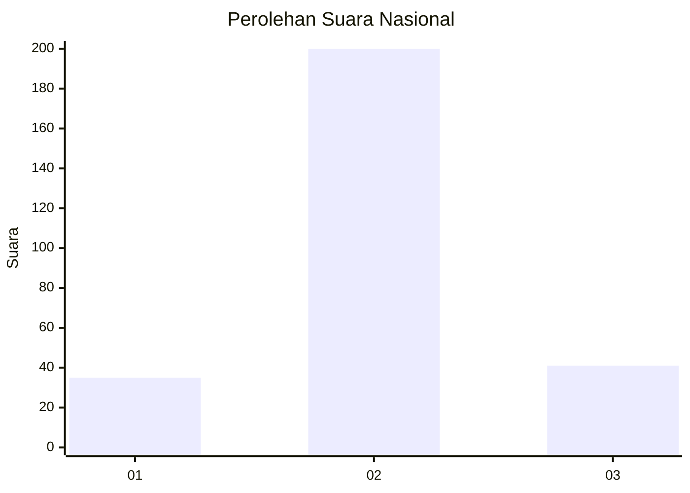
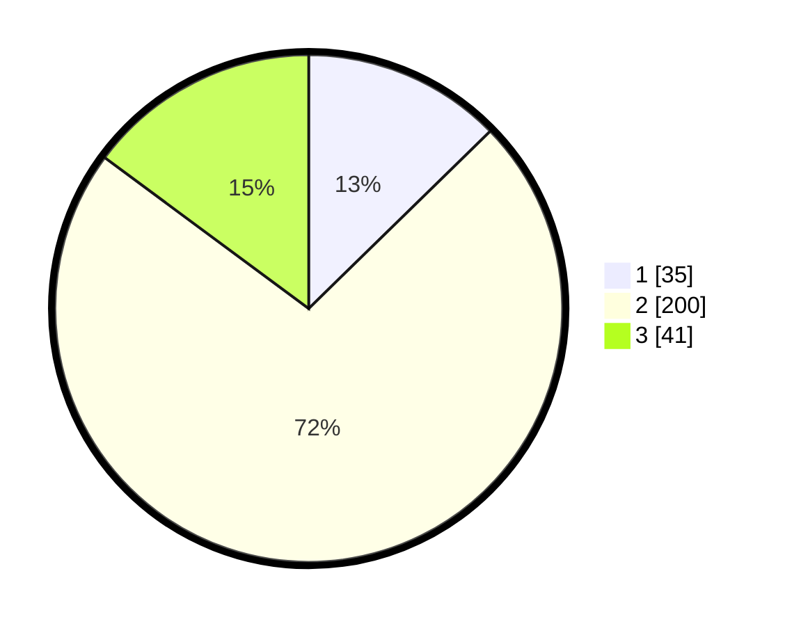

# Hasil

## Grafik

## Tabel

| No. | Nama Paslon    | Suara | Suara (raw) | Persentase |
|:--- |:-------------- | -----:| -----------:| ----------:|
| 1   | ANIES MUHAIMIN | 35    | [35][p-1]   | 12,68      |
| 2   | PRABOWO GIBRAN | 200   | [200][p-2]  | 72,46      |
| 3   | GANJAR MAHFUD  | 41    | [41][p-3]   | 14,86      |

[p-1]: https://github.com/gigit-pemilu/pemilu-2024/blob/main/pilpres/hitung-suara/sub/94-papua-tengah/sub/08-deiyai/sub/01-tigi/sub/2011-mugouda/sub/004-tps/sub/paslon-1.txt
[p-2]: https://github.com/gigit-pemilu/pemilu-2024/blob/main/pilpres/hitung-suara/sub/94-papua-tengah/sub/08-deiyai/sub/01-tigi/sub/2011-mugouda/sub/004-tps/sub/paslon-2.txt
[p-3]: https://github.com/gigit-pemilu/pemilu-2024/blob/main/pilpres/hitung-suara/sub/94-papua-tengah/sub/08-deiyai/sub/01-tigi/sub/2011-mugouda/sub/004-tps/sub/paslon-3.txt

## Foto C Plano

https://sirekap-obj-formc.kpu.go.id/8fbb/pemilu/ppwp/94/08/01/20/11/9408012011004-20240216-202307--418cf210-74fb-44ae-9b29-8ad130eb9fa1.jpg

https://sirekap-obj-formc.kpu.go.id/8fbb/pemilu/ppwp/94/08/01/20/11/9408012011004-20240216-203235--d58afa19-10f3-462e-9bd3-7a7d0d653dad.jpg

https://sirekap-obj-formc.kpu.go.id/8fbb/pemilu/ppwp/94/08/01/20/11/9408012011004-20240216-203037--70713d0a-a486-4d13-b4c7-32f8161de7d7.jpg

## Metadata

| Key        | Value               |
| ---------- | ------------------- |
| Time Stamp | 2024-02-17 16:00:02 |

## DATA PEMILIH TETAP

Jumlah pemilih dalam DPT: **276**.
 * L: **131**.
 * P: **145**.

## DATA PENGGUNA HAK PILIH

Jumlah pengguna hak pilih dalam DPT: **276**.
 * L: **131**.
 * P: **145**.

Jumlah pengguna hak pilih dalam DPTb: **0**.
 * L: **0**.
 * P: **0**.

Jumlah pengguna hak pilih dalam DPK: **0**.
 * L: **0**.
 * P: **0**.

Jumlah pengguna hak pilih: **276**.
 * L: **131**.
 * P: **145**.

## JUMLAH SUARA SAH DAN TIDAK SAH

JUMLAH SELURUH SUARA SAH: **276**.

JUMLAH SUARA TIDAK SAH: **0**.

JUMLAH SELURUH SUARA SAH DAN SUARA TIDAK SAH: **276**.

